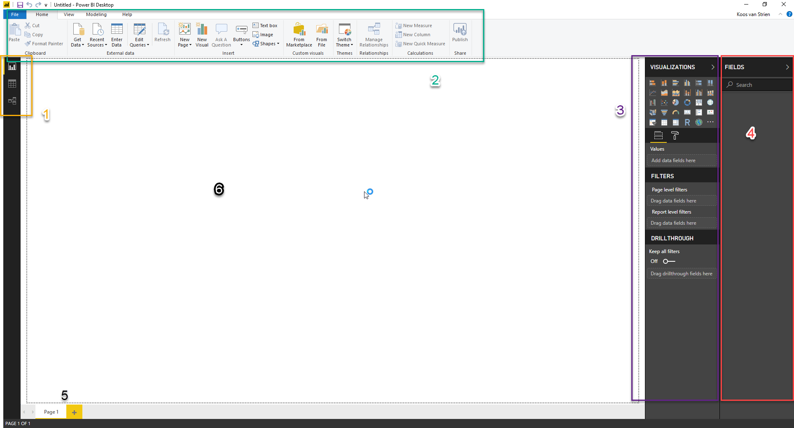

# Introductie Power BI

## Power BI Desktop downloaden en de eerste start

### Downloaden van Power BI

Op de cursus-VM's is het programma "Power BI Desktop" reeds geïnstalleerd. Power BI Desktop is **gratis** - je kunt het dus vrij op elke Windows-machine installeren waar je maar wilt (helaas is Power BI nog niet voor de Mac beschikbaar). In dat geval kun je het downloaden vanaf de Windows Store, of vanaf [www.powerbi.com](https://powerbi.microsoft.com/nl-nl/). Wanneer het mogelijk is, installeer Power BI dan vanuit de Windows Store: dit zorgt ervoor dat je automatisch updates e.d. krijgt, en deze niet handmatig hoeft te downloaden.

### De eerste start

De eerste keer dat je Power BI start zie je het volgende scherm:

.

Klik op de link "Already have a Power BI account? Sign in" onderin het venster. Je kunt hier inloggen met je TMG-account.

(Het zou kunnen dat Power BI aangeeft dat je je hier voor moet registreren - doe dit dan. Als je dit proces in de browser volledig doorlopen hebt, kun je binnen enkele minuten met je TMG-account inloggen bij Power BI Desktop).

Het scherm ziet er nu als volgt uit:

Merk de volgende zaken op:

1. Linksboven zie je drie knoppen, waarmee je tussen *drie weergaven* van je Power BI model kunt schakelen:
   * *Report*
   * *Data*
   * *Relationships*
2. Bovenin zie je een *ribbon* (of "lint"), die net werkt als in Office kent. De lint heeft vijf onderdelen:
   * *File* (menu): Vergelijkbaar met het gelijknamige menu uit Office: opslaan, exporteren, printen en instellingen.
   * *Home*: Hier staan de meeste "basis" zaken die je nodig hebt voor het maken van Power BI-rapportages.
   * *View*: Hier kun je visuele hulpmiddelen aan- en uitzetten, en schakelen tussen de mobiele weergave en de desktop-weergave
   * *Modeling*: Hier staan specifieke zaken voor het inrichten van je datamodel
   * *Help*: Dit is een bijzonder ingewikkeld concept, dat voor nu te ver reikt om uit te leggen ;-).
3. Aan de rechterzijde (paars omlijnd hierboven) zie je het *Visualizations* _pane_. Deze kun je inklappen door op "Visualizations" te klikken (try!). Er zijn drie onderdelen in dit _pane_:
   * *Visualizations*: De verschillende visualisaties die je in een rapport kunt gebruiken
   * *Filters*: filters die van toepassing zijn op het huidige rapport, de huidige pagina, of de huidige visual
   * *Drilltrough*: Bijzondere drillthrough-filters (meer hierover later)
4. Uiterst rechts op het scherm (rood omrand) is het *Fields* pane). Ook deze kun je inklappen. Hier zie je een lijst van alle tabellen, kolommen en measures die in je datamodel aanwezig zijn
5. Binnen de Report-weergave, zie je onderin de verschillende *pagina's* van een rapport
6. Binnen de Report-weergave is een groot wit vel aanwezig. Hierop kun je je rapport vormgeven. De zwarte stippellijnen geven de randen aan.

## Volgende modules

De volgende module is [Module 2: Rapporteren op kubus-data](../02-Reporting-on-Cube-Data/02-reporting-on-cube-data.md). Hieronder vind je een overzicht van alle modules:

1. [Introductie Power BI Desktop](../01-Introduction/01-introductie-powerbi-desktop.md) (huidige module)
2. [Rapporteren op kubus-data en eerste visualisatie](../02-Reporting-on-Cube-Data/02-reporting-on-cube-data.md)
3. Self-service reporting
   * [CSV-bestanden inladen](../03-Self-service-reporting/03-csv-inladen.md)
   * [SQL data inladen](../03-Self-service-reporting/04-sql-inladen.md)
4. Data Modeling 101
   * [Relaties](../04-Data-Modeling-101/05-relaties.md)
   * [Opschonen van je datamodel](../04-Data-Modeling-101/06-opschonen.md)
   * [Verrijken met Calculated Columns](../04-Data-Modeling-101/07-calc-columns.md)
5. [Introductie Power Query (GUI)](../05-Power-Query-GUI/08-power-query.md)
