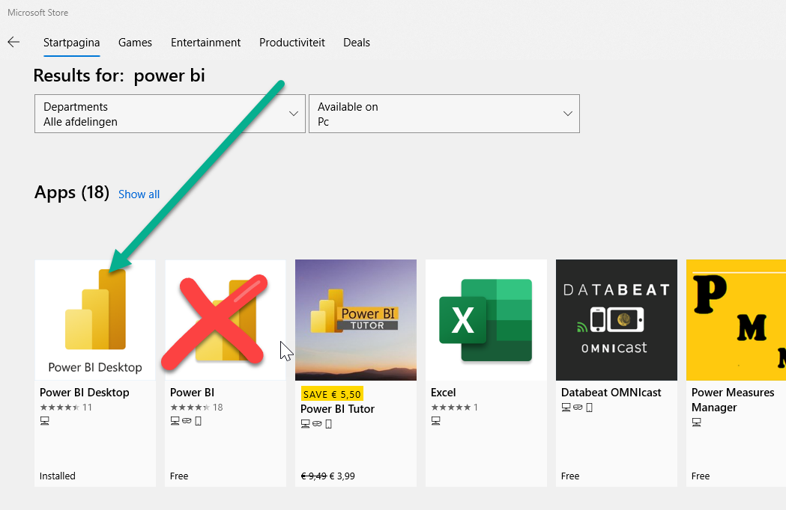
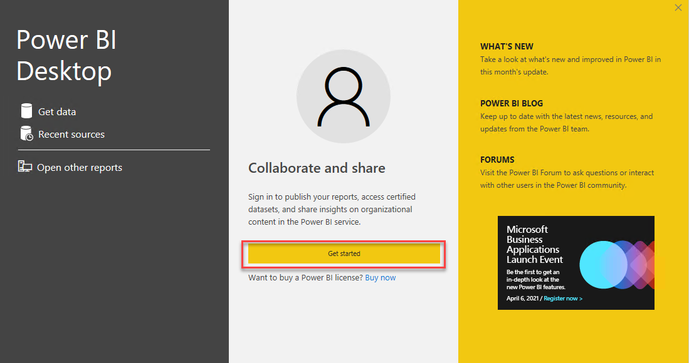
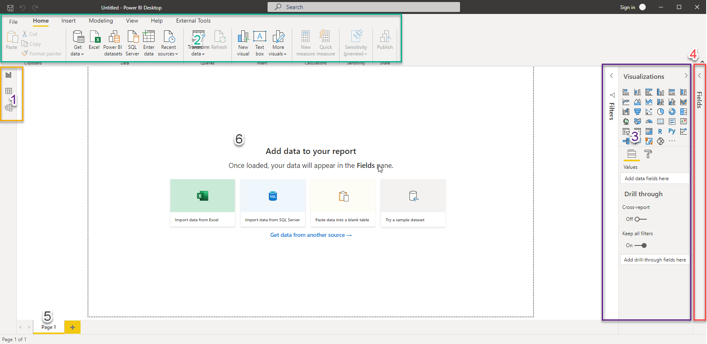
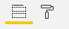

# 01 Introduction to Power BI

## Download and install Power BI Desktop

### Download Power BI Desktop

You can download and install Power BI Desktop for free on every Windows-machine. If you haven't yet installed Power BI on your computer, you can either download Power BI from Microsoft Store, or directly from [www.powerbi.com](https://powerbi.microsoft.com/en-us/). Whenever possible, install Power BI Desktop from Microsoft Store: this will keep Power BI Desktop up-to-date automatically.

If you install Power BI from Microsoft Store, be sure to select the right version! You will see (at least) three different options displayed:

* **Power BI** is a tablet application used to display (not author) reports
* **Power BI Desktop** is the right app for authoring reports
* **Power BI Report Builder** is an application to create "Paginated Reports", which you can ignore for now.

Download Power BI Desktop.

### First Steps

At the first start, Power BI Desktop opens with a popup window:

Click on "Get Started" to log in and start working with Power BI.

If you do not have a Power BI account yet, you can easily create one by pressint **Sign up for Power BI**. Immediately after completing this process inside your browser you can sign in with your brand new account in Power BI Desktop.

Your screen will now look like this:

Take note of these five areas:

1. Three buttons to switch to the three different *views* of your Power BI model:
   * **Report**
   * **Data**
   * **Model**
2. The **ribbon** with seven components:
   * **File**: This is the menu, just like the identically named menu in Office: save, export, print and application settings
   * **Home**: Most essential functions for creating Power BI reports are located here
   * **Insert**: Objects to insert into your reports
   * **Modeling**: Specific options for setting up your Dataset
   * **View**: Visual assistance (think grid lines), as well as the possibility to switch between the mobile view and desktop view modes.
   * **Help**: This is a rather complex feature, which we will not explain right here ;-)
   * **External Tools** Not always displayed (although it is on the screenshot), makes it possible to use other applications to work on your Power BI Reports or Datasets.
3. On the right you will see two *panes*: **Visualizations** and **Filters**. You can collapse and expand panes by clicking on the title. Four main areas are visible:
   * **Filters**: Filters active on the current report, page, or visual
   * **Visualizations**: Available visualizations for use in this report.
   * **Add data** / **Format**: These are located within the **Visualizations** pane, as "tabs" signified by these two icons:
   
   * **Drill trough**: Filters for use with Drill Through (we will dive into this later on)
4. On the far right is the **Fields** pane. When the pane is expanded (and you have some data within Power BI), you will see a list of all tables, fields en measures in the Dataset
5. Within the Report view you will see the different **pages** of a report located on the bottom.
6. Within the Report view a white **canvas** is located in the middle. Here you will view your report. The black dotted line marks the edges of the report.

## Next modules

The next module is [Module 2: Reporting on a Dataset](../02-reporting-on-dataset/02-reporting-on-dataset.md). Below is a complete overview of all available modules:

1. [Introduction Power BI Desktop](../01-introduction/01-introduction-powerbi-desktop.md) (current module)
2. [Reporting on a Dataset](../02-reporting-on-dataset/02-reporting-on-dataset.md)
3. [Visuals and interaction](../03-visuals-and-interaction/03-visuals-and-interaction.md)
4. [Drillthrough](../04-drillthrough/04-drillthrough.md)
5. Self-service reporting
   * [Loading CSV files](../05-self-service-reporting/05-csv-inladen.md)
   * [Loading data from SQL Databases](../05-self-service-reporting/06-sql-inladen.md)
6. Data Modeling 101
   * [Relations](../06-data-modeling-101/07-relaties.md)
   * [Cleaning up your Data Model](../06-data-modeling-101/08-opschonen.md)
7. [Introduction to Power Query (GUI)](../07-power-query-gui/09-power-query.md)
8. [Publishing and Collaboration in Workspaces](../08-publishing-and-collaboration-in-workspaces/10-publishing-and-collaboration-in-workspaces.md)
9. [Calculated Columns in DAX](../09-dax/11-calc-columns.md)
