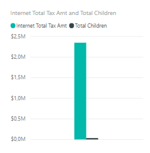
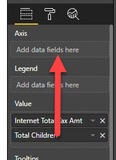
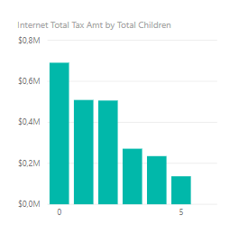
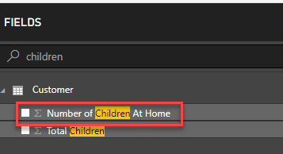
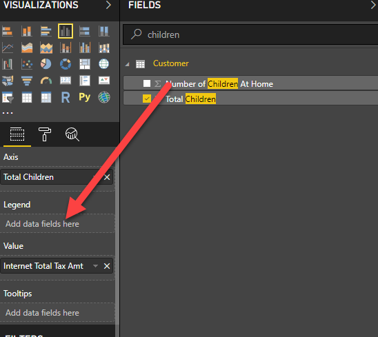
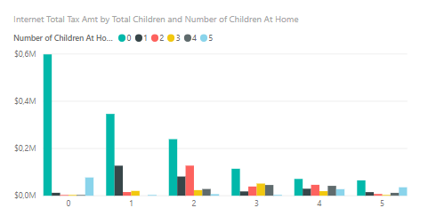
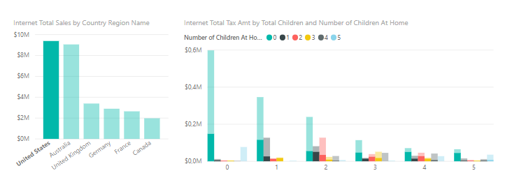
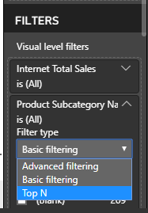
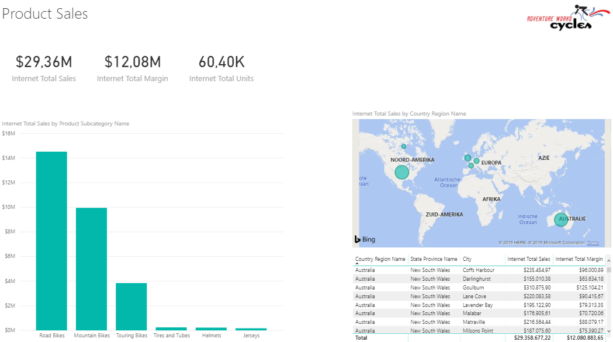

# Rapporteren op de kubus: Power BI als rapportageschil

Power BI kan als volledige "self-service" tool gebruikt worden, maar ook inprikken op bestaande kubussen.

## Verbinding maken met de kubus

Maak binnen Power BI verbinding met Analysis Services:

* Klik "Get Data"
* Klik "Analysis Services"
* Vul bij "Server" de volgende naam in:
  * `asazure://westeurope.asazure.windows.net/bitrainer`
* Verifieer dat **Connect live** geselecteerd is. Dit zorgt ervoor dat alle queries direct naar de kubus gaan, en we zelf geen data hoeven in te laden of te modelleren.
* Klik op **OK**
* Log in met de volgende credentials:
  * Username: `student@bitrainer.nl`
  * Password: `BITrainer.nl`
* Selecteer nu de kubus **Model**. Aan de rechterzijde zie je een lijst met dimensies en measures die beschikbaar zijn in deze kubus.
* Klik op **OK**

## Eerste visualisatie

Doordat we ingeprikt hebben op een bestaande kubus, kunnen we gebruikmaken van kwalitatief hoogstaande data. Vaak is deze al gecontroleerd op missende waarden, inconsistentie en andere zaken waar we vaak tegenaan lopen wanneer we zelf data inladen. Ook is in het datamodel aangegeven hoe de verschillende relaties tussen de tabellen liggen, en zijn er meestal *measures* aangemaakt waarin berekeningen "klaarstaan" die voor onszelf vaak lastiger zijn. We kunnen dus eenvoudig data uit meerdere tabellen combineren - de kubus zorgt voor de juiste interacties.

We gaan nu twee Power BI visualsiaties maken:

* Internet Total Sales per Country Region Name
* Internet Total Tax amt per Total Children

### Internet Total Sales per Country Region Name

Deze is redelijk eenvoudig:

1. Zoek in het **Fields** pane via de zoekbox de *measure* **Internet Total Sales**. Klik deze aan.
2. Zoek nu naar "Country", en vink **Country Region Name** aan.

Zoals je ziet, gaat deze grafiek eigenlijk automatisch goed. En hoewel de kubus erg groot kan zijn, kun je eenvoudig zoeken in de lijst met velden.

### Internet Total Tax per Total Children

3. Probeer nu stappen 1 en 2 opnieuw uit te voeren voor **Internet Total Tax** en **Total Children** (de laatste is een eigenschap van een klant)

Omdat *Total Children* een numerieke waarde is, maakt Power BI hier automatisch een zogenaamde *measure* van: een meetwaarde die optelbaar is. Je ziet dus de som van alle kinderen van alle klanten nu weergegeven naast de betaalde belasting. Wanneer je het sigma-teken &Sigma; ziet staan voor een veld, is dit een indicatie dat Power BI het als *measure* kan gebruiken (hoewel de kubus het niet expliciet als *measure* heeft aangeboden!)

4. Zorg er nu voor dat de grafiek die je zojuist gemaakt hebt geselecteerd is.
5. Verplaats nu in de **Eigenschappen** van de grafiek (onder de **visualizations** pane) het veld **Total Children** van het kopje **Value** naar **Axis**.

Hiermee geven we aan dat "Total Children" niet een veld is dat we willen optellen, maar dat we op de as willen zetten, om erlangs uit te splitsen. Het resultaat is nu als volgt:

Stel dat we nu een extra uitsplitsing zouden willen doen naar het aantal kinderen dat nog thuis is (*Number of Children at Home*), dan zien we in de fields-lijst ook hier een sigma-teken voor staan. 

We kunnen er echter ook expliciet aangeven hoe Power BI dit veld toevoegt aan een grafiek:

6. Zorg er nu voor dat de grafiek die je zojuist gemaakt hebt geselecteerd is.
7. Sleep het veld **Number of Children at Home** vanuit de **Fields** lijst naar het kopje **Legend**

8. *Resize* de grafiek zodat deze netjes wordt weergegeven:

## Interactie tussen grafieken

Klik op één van de landen in de eerste grafiek. Zoals je ziet verandert de andere grafiek mee.

## Meerdere pagina's

Een rapport kan uit meerdere pagina's bestaan. Deze worden als "tabjes" weergegeven onder aan het rapport. 

9. Klik op het plus-teken om een nieuwe pagina toe te voegen.
10. Hernoem de eerste pagina naar "Overzicht"
11. Hernoem de tweede pagina naar "Finance-specifiek"

## Hands-on: rapportage maken

Hieronder staan op een iets hoger niveau de stappen om een rapport te maken. Wanneer je er niet uitkomt: even vragen! Het niveau is hier bewust wat hoger, om je ervaring met de tool te vergroten.

12. Maak een nieuwe tab, genaamd 'Product Sales'
13. Schakel naar deze nieuwe tab
14. Maak een grafiek waarin je de **Internet Total Sales** uitzet tegenover **Product Subcategory Name**
15. Selecteer deze grafiek.
16. Verander de **Visual level filter** voor **Product Subcategory Name** in een **Top N** filter

17. Filter deze op de top 6, vul onder **by value** de waarde **Internet Total Sales** in.
18. Klik **Apply filter**

Als het goed is, ziet je grafiek er nu als volgt uit:

19. Probeer nu zelf een **map visual** toe te voegen (dit is het "witte" wereldbolletje onder **Visualizations**). Zet hierin de **Country Region Name** uit tegen **Internet Total Sales**. Maak de grafiek vervolgens breed genoeg zodat alle landen waar verkocht wordt duidelijk zichtbaar zijn.
20. Voeg nu een tabel toe met de volgende daarin de volgende velden:
   * **Country Region Name**
   * **State Province Name**
   * **City**
   * **Internet Total Sales**
   * **Internet Total Margin**
21. Plaats de tabel en kaart direct onder elkaar, en maak ze exact even breed.
22. Voeg nu een titel toe aan de pagina, door een **Text box** te kiezen uit de **Home** ribbon. Maak deze tekst groter (bijv. 32), en vul de tekst **Product Sales** in. Plaats deze volledig linksbovenin het rapport
23. Voeg drie **Card** visuals toe, voor de volgende velden:
   * **Internet Total Sales**
   * **Internet Total Margin**
   * **Internet Total Units**
24. Zet de drie **Card** visuals strak naast elkaar direct onder de titel.
25. Maak de pagina af met een willekeurig bedrijfslogo rechtsbovenin (je kunt hier bijvoorbeeld het AdventureWorks-logo opzoeken)

Het eindresultaat kan er bijvoorbeeld als volgt uit zien:

## Volgende modules

De volgende module is **Self-service reporting**, waarbij we starten met  [CSV-bestanden inladen](../03-Self-service-reporting/03-csv-inladen.md). Hieronder vind je een overzicht van alle modules:

1. [Introductie Power BI Desktop](../01-Introduction/01-introductie-powerbi-desktop.md)
2. [Rapporteren op kubus-data en eerste visualisatie](../02-Reporting-on-Cube-Data/02-reporting-on-cube-data.md) (huidige module)
3. Self-service reporting
   * [CSV-bestanden inladen](../03-Self-service-reporting/03-csv-inladen.md)
   * [SQL data inladen](../03-Self-service-reporting/04-sql-inladen.md)
4. Data Modeling 101
   * [Relaties](../04-Data-Modeling-101/04-relaties.md)
   * [Opschonen van je datamodel](../04-Data-Modeling-101/05-opschonen.md)
   * [Verrijken met Calculated Columns](../04-Data-Modeling-101/06-calc-columns.md)
5. [Introductie Power Query (GUI)](../05-Power-Query-GUI/07-power-query.md)