# 02 Reporting on a Dataset

Power BI can be used as "self-service" analytics tooling, where you ingest, transform and analyze data. However, it can also work with Datasets that are already developed by others.

> ## What is a Dataset?
>
> A Power BI Dataset is a Data Model (a collection of tables and relations between tables) ready for analysis. You can embed all kinds of logic into a Dataset, so new questions can be answered easily with a few clicks. A few terms are used extensively, and thus worth explaining:
>
> * **Measures** are the figures you want to analyse.
>   * Often simple, additive values ("number of widgets sold")
>   * A Dataset makes it possible to create more advanced measures, like:
>     * Percentage of budget used
>     * Number of screws in a particular warehouse
>     * Year-to-Date sales of screws
>   * By creating a well-defined Dataset even complex measures will be calculated correctly along several *dimensions*
> * **Dimensions** are the "axes" used to break down measures:
>   * In your analysis requirements, listen for the *per*:
>     * Sales *per year*
>     * Homicides *per district* *per month*
>     * Residential garbage *per street*
>   * These *per* definitions are often dimensions:
>     * District
>     * Period (month/year/date)
>     * Product Category
>     * etc.
>
> Datasets also make it possible to have the extraction and modeling of data done by people other than making the reports themselves. But even if you do everything by yourself, you always create a dataset underwater.

## Preparation

Before we can start with this dataset, you need to prepare the dataset in your own Power BI environment. To do this, take the following steps:

1. Open the file [AdventureWorks.pbix](AdventureWorks.pbix)
1. Click the **Publish** button  
   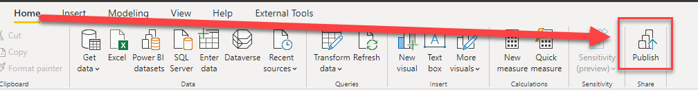  
   The window **Publish to Power BI** pops up, and asks you to select a  *workspace* for publication.
1. Choose **My workspace**, and click on **Select**:  
   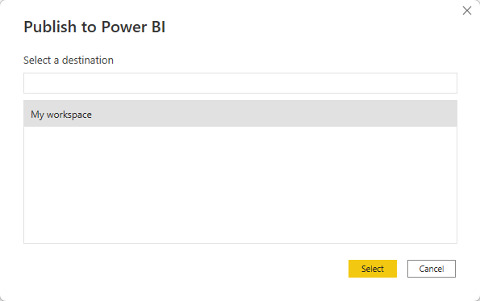  
   A window should now pop up, with a green tick mark and the text **Success!**
1. Close the popup by clicking **Got it**
1. **Close the Power BI window**

You have just set up a Power BI dataset for yourself. This was a bit of preparation that we now had to do ourselves, but normally this can also be done by someone else. For example, by someone from a Business Intelligence or Data Engineering team, who has prepared data that is widely used in various places in the organization.

**Attention: it is important that all Power BI windows are closed after completing these steps (if not, close them now).**

## Connecting to the Power BI Dataset

We will now connect tot the Power BI Dataset we just published in a **new** Power BI report. This way, we simulate the situation where the Dataset has already been prepared for us.

6. Open **Power BI Desktop**
6. Connect to a **Power BI Dataset**:
   * Click on the arrow just below the "Get Data" button
   * Click **Power BI Datasets**
   * Select the **AdventureWorks** Dataset
   * Click **Create**

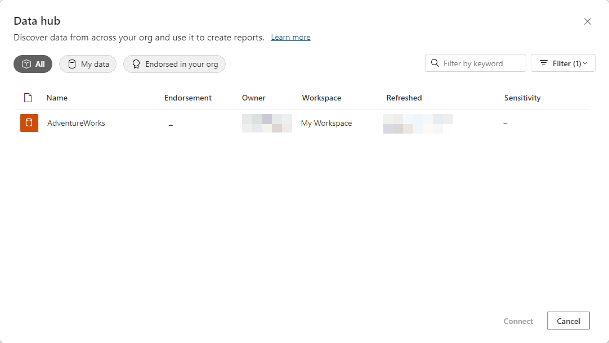

> ## The case
>
> In this course we look at a fictional company that Microsoft often uses as an example in its courses: **AdventureWorks**.
>
> AdventureWorks sells bicycles and bicycle parts - both directly to > customers and through distributors. They have an office in the Netherlands, and sell bicycles in the US, Germany and Spain - both through the various distributors and directly through the website to customers.

## First visualization

Because we have tapped into an existing data set, we can use high-quality data. This has already been checked for missing values, inconsistency and other issues that we often run into when we load data ourselves. The data model also indicates how the various relationships between the tables lie, and *measures* are usually created in which calculations are "ready" that are often more difficult for ourselves. So we can easily combine data from multiple tables - the dataset ensures the right interactions.

In this first exploration, we're going to look at data from AdventureWorks. Specifically, we look at the **Internet Total Sales** (the total amount of Internet sales) and the **Internet Total Tax amt** (the amount of tax they pay through Internet sales). To get a sense of what the data looks like, we make a few intersections with it.

We will do this by creating two visualizations:

* Internet Total Sales per Country Region Name
* Internet Total Tax amt per Total Children

### Internet Total Sales per Country Region Name

This one is fairly simple:

8. In the **Fields** pane, using the search box, find the *measure* **Internet Total Sales**. Select the measure by clicking the empty box immediately left to the title.  
   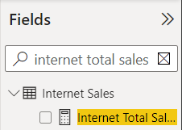
8. Now search for "Country", and select **Country Region Name**.

As you can see, this chart actually goes well automatically. And although the amount of tables and columns can be very large, you can easily search in the list of fields.

### Internet Total Tax per Total Children

10. Now try to do steps 8 and 9 again, but this time create the graph for **Internet Total Tax Amt** and **Total Children** (the latter is a customer property)

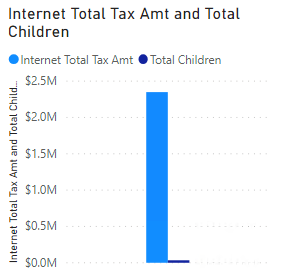

Because *Total Children* is a numeric value, Power BI automatically creates a measure that can be summed. So you see the sum of all children of all customers now displayed next to the tax paid. When you use the sigma character &Sigma; before a field, this is an indication that Power BI can use it as *measure* (although the dataset didn't explicitly provide it as *measure*!)

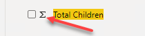

11. Make sure the chart you just created is selected.
11. Move the **Total Children** field from the **Value** heading to **Axis** in the **Properties** of the chart (below the **visualizations** pane)..

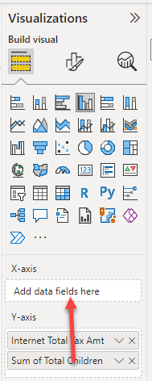

This indicates that "Total Children" is not a field that we want to add, but that we want to put on the axis, to divide along it. The result is now as follows:

Suppose we now want to make an extra breakdown according to the number of children who are still at home (*Number of Children at Home*), then we also see a sigma sign in the fields list.

However, we can also explicitly specify how Power BI adds this field to a chart:

13. Now make sure that the chart you just created is selected.
13. Drag the **Number of Children at Home** field from the **Fields** list to the **Legend** heading

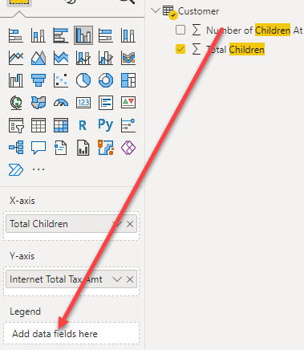

15. Resize the chart to display neatly:

## Interaction between charts

Click on one of the countries in the first chart. As you can see, the other graph changes with it.

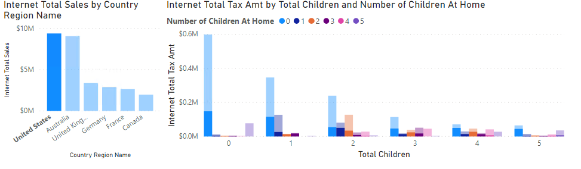

## Hands-on: Create Report

Since Power BI is new within AdventureWorks, your manager is very curious about what its possibilities. Among other things, he has heard a lot about the geographic representations that are standard in it, and has asked you to try a few things with it.

Below are the steps to create a report at a slightly higher level. This is deliberate (so that your experience with the tool is increased) - but don't worry if you get stuck, just ask for help!

16. Create a new page called 'Product Sales'
16. Switch to this new page
16. Make a graph in which you plot the **Internet Total Sales** against *Product Subcategory Name** (*take this from the Product Subcategory dimension*!)
16. Select this chart.
16. Change the **Filter on this visual** for **Product Subcategory Name** into a **Top N** filter

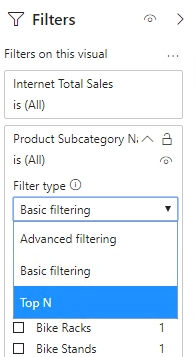

21. Filter on the top 6, drag the field "**Internet Total Sales** to the heading **by value**.
21. Click **Apply filter**
21. Try adding a **map visual** yourself (this is the "white" globe under **Visualizations**). Plot the **Country Region Name** against **Internet Total Sales**. Then make the chart wide enough so that all countries where sales are made are clearly visible.
21. Add a table containing the following fields:
    * **Country Region Name**
    * **State Province Name**
    * **City**
    * **Internet Total Sales**
    * **Internet Total Margin**
21. Place the table and card directly below each other, and make them exactly the same width.
21. Add a title to the page, by choosing a **Text box** from the **Home** ribbon. Make this text larger (eg 32), and enter the text **Product Sales**. Place it completely at the top left of the report
21. Add three **Card** visuals, for the following fields:
    * **Internet Total Sales**
    * **Internet Total Margin**
    * **Internet Total Units**

> To discover what a **Card** visual is, you will have to explore the names of the visualizations. The name of a visual is displayed as *tooltip* when you rest the cursor on it for a while:
>
> 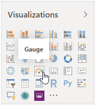

28. Place the three **Card** visuals next to each other directly below the title. Reduce the text if necessary.
28. Complete the page with any company logo at the top right (for example, you can look up the AdventureWorks logo here, or your own company logo)

For example, the end result might look like this:

## Solution

Here's the endpoint of this lab: [02-Solution](02-Solution.pbit)

## Video

Here is a [Walkthrough video](https://vimeo.com/584747639/0f39be6d96) (no sound)

## Next modules

The next module is [Module 3: Visuals and interaction](../03-visuals-and-interaction/03-visuals-and-interaction.md). Below is a complete overview of all available modules:

1. [Introduction Power BI Desktop](../01-introduction/01-introduction-powerbi-desktop.md)
2. [Reporting on a Dataset](../02-reporting-on-dataset/02-reporting-on-dataset.md) (current module)
3. [Visuals and interaction](../03-visuals-and-interaction/03-visuals-and-interaction.md)
4. [Drillthrough](../04-drillthrough/04-drillthrough.md)
5. Self-service reporting
   * [Loading CSV files](../05-self-service-reporting/05-csv-inladen.md)
   * [Loading data from SQL Databases](../05-self-service-reporting/06-sql-inladen.md)
6. Data Modeling 101
   * [Relations](../06-data-modeling-101/07-relaties.md)
   * [Cleaning up your Data Model](../06-data-modeling-101/08-opschonen.md)
7. [Introduction to Power Query (GUI)](../07-power-query-gui/09-power-query.md)
8. [Publishing and Collaboration in Workspaces](../08-publishing-and-collaboration-in-workspaces/10-publishing-and-collaboration-in-workspaces.md)
9. [Calculated Columns in DAX](../09-dax/11-calc-columns.md)
