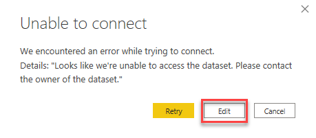
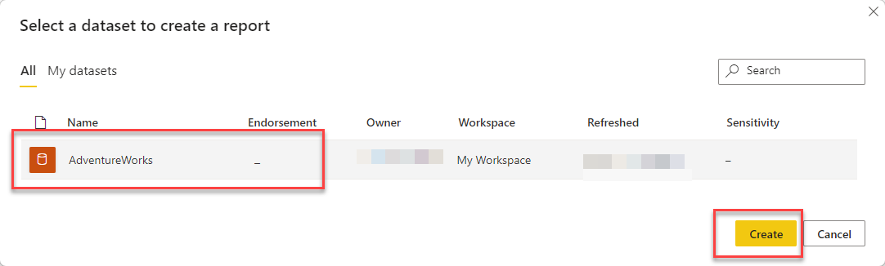
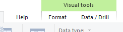
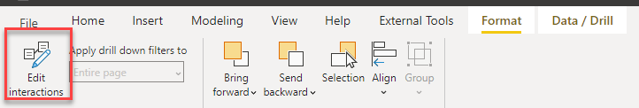
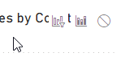
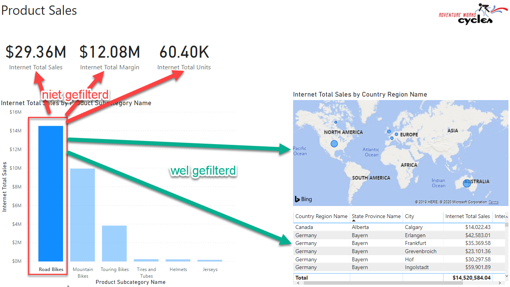
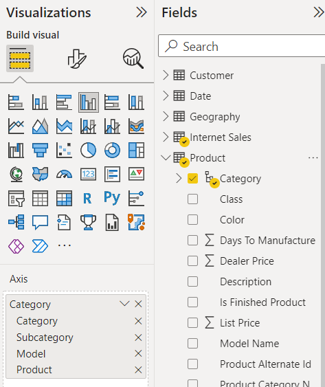
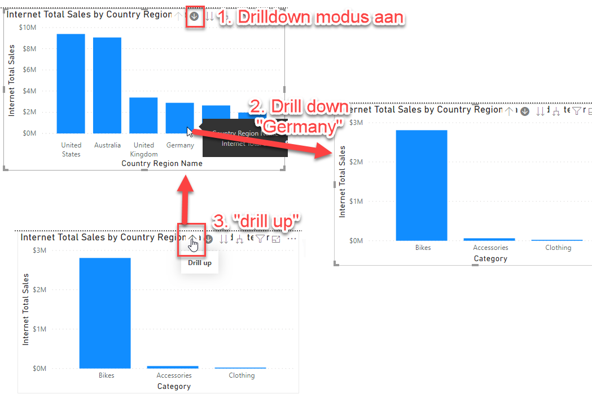
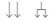

# 03 Visuals and interaction

Within Power BI there are many options to adjust the display and operation of your reports. In this module, we want to look at this a little further on the basis of the following points:

* Interactions between charts
* *Drilldown* and hierarchy
* Using predefined hierarchy
* Customize visuals
* *Custom visuals* from the *Power BI Marketplace*

## Preparation

**Open** the file [03-Start.pbit](03-Start.pbit)

You might see the following warning:

If this happens, click on **edit** and choose the **AdventureWorks** dataset in your workspace:

## Interactions

In the [previous module](../02-reporting-on-dataset/02-reporting-on-dataset.md) we saw in Power BI there's by default *interaction* between charts. When you click on a chart, other charts will react:

* Select the right chart on **Page 1** (*Internet Total Tax Amt by Total Children and Number of Children At Home*).

The moment you select a chart, two new items appear on the ribbon at the top of the screen: *Format* and *Data / Drill*

* Open **Format**, and click on **Edit Interactions**

In your report you will now see one or more of the following icons appear in the top right corner of your report *except for the currently selected graph*:

This determines how the chart in question will react when you change the chart you selected:

* **Filter** (option 1) - any data not within the selection will not be displayed
* **Highlight** (option 2, default setting) - anything outside the selection will be dimmed
* **Do not filter** (option 3) - nothing changes no matter what you click

Try out the three options and see the effects.

Now change the report on the **Product Sales** page so that:

* Selecting a Product Subcategory in the left graph (eg "Road Bikes") does not filter the content of the three *card visuals* (*Internet Total Sales*, *Internet Total Margin* and *Internet Total Units*). So these numbers don't change, regardless of your selection.
* When you select something at the bottom right of the table (eg "Germany"), the left graph (*Internet Total Sales by Product Subcategory Name*) is filtered. So only the sales of that table row in question are visible here.

Check the results by selecting "Road Bikes". The result will be as follows:

## Hierarchy and drilldown

### Hierarchy

Much of the data we analyze has a hierarchy in it:

* THe first analysis is done on annual or quarterly figures, then we descend towards months or days
* We start with an analysis of the performance of account managers, after which we look more specifically at the underlying customers
* We analyze our product sales by category, see that most sales are in bicycles, so we break that down into the subcategories.

In the data models that we purchase from a data set or Power BI model, data is often already offered in a hierarchy. For example, the Category hierarchy in the *Product* table:

* Create a new tab
* Select the *measure* **Internet Total Sales**
* Select the *hierarchy* **Category** in the **Product** table
* View chart properties.
  * Under "Axis" it says *Category*
  * You see various levels here (Category, Subcategory, Model, Product), yet only the highest level is currently visible in the graph.
* Widen the chart a bit so you can see the full title. The title is currently "Internet Total Sales by Category": the visible level.

### Drilldown: first exploration

At the top right of the graph is a collection of arrows. These are for navigating through the hierarchy.

* Click on the down arrow ().
  * This arrow stands for *drilldown* (the BI term for "zooming in" to a lower level)
* Click on the "Bikes" category. You see that:
  1. Chart title changes to *Internet Total Sales by Category and Subcategory*
  2. The subcategories at the Subcategory level are displayed *which are within Bikes*
* When you want to zoom out again (*drill up*), click on the arrow up.

### More hierarchy and drilldown

Another hierarchy present in this dataset is the *Calendar* hierarchy (within the **Date** table).

* Create a chart that breaks down **Internet Total Sales** over **Calendar**.
* *Drill down* to the year 2020.
  * The graph **Internet Total Sales by Category** now filters along.

Now when we do a *drill down* on a year, we first come to a semester, and then to a quarter. But we don't need these levels in our report. So we remove these fields (for this particular chart) from the hierarchy.

* In the properties of the chart, under *Axis*, remove the levels **Semester** and **Quarter**

The hierarchy has now become *in this graph* Year-Month-Day. Verify this.

### Creating a hierarchy manually

* Now select the left chart again *Internet Total Sales by Category*
* From the **Fields** *pane*, drag the **Country Region Name** field from the **Geography** table to the **Axis** field. Place the field *above* the *Category* hierarchy.

The chart title is now *Internet Total Sales by Country Region Name*, and we can do a *drilldown* further down the *Category* hierarchy, based on the country we're looking at.

### Go to the next level

In addition to a *drilldown*, you can also descend a level in the hierarchy without being specifically limited to one category. This can be done with the right two buttons:

In the left graph, go to the highest level (ie *Country Region Name*), and try the last two buttons. What is the difference?

### Filtering other visuals

As you may have noticed, a *drilldown* also filters other charts: when you select a country in the left chart, the *Internet Total Sales by Year* chart also changes:

By default, the filtering of a *drilldown* works the same as the filtering of a *selection* (which you have set for example via **Edit interactions**) within the graph. However, you can also disable the drilldown filtering.

* Select the left chart (*Internet Total Sales by Country Region Name*)
* Open the *Format* menu
* Next to the button *Edit interactions* is a pulldown menu, change *Entire Page* to *Selected visual*.

Now a *drilldown* no longer automatically filters within another chart. Selections still work.

## Solution

Here's the endpoint of this lab: [03-Solution](03-Solution.pbit)

## Video

Here is a [Walkthrough video](https://vimeo.com/584747018/6e578554b1)

## Next modules

The next module is [Module 4: Drillthrough](../04-drillthrough/04-drillthrough.md). Below is a complete overview of all available modules:

1. [Introduction Power BI Desktop](../01-introduction/01-introduction-powerbi-desktop.md)
2. [Reporting on a Dataset](../02-reporting-on-dataset/02-reporting-on-dataset.md)
3. [Visuals and interaction](../03-visuals-and-interaction/03-visuals-and-interaction.md) (current module)
4. [Drillthrough](../04-drillthrough/04-drillthrough.md)
5. Self-service reporting
   * [Loading CSV files](../05-self-service-reporting/05-csv-inladen.md)
   * [Loading data from SQL Databases](../05-self-service-reporting/06-sql-inladen.md)
6. Data Modeling 101
   * [Relations](../06-data-modeling-101/07-relaties.md)
   * [Cleaning up your Data Model](../06-data-modeling-101/08-opschonen.md)
7. [Introduction to Power Query (GUI)](../07-power-query-gui/09-power-query.md)
8. [Publishing and Collaboration in Workspaces](../08-publishing-and-collaboration-in-workspaces/10-publishing-and-collaboration-in-workspaces.md)
9. [Calculated Columns in DAX](../09-dax/11-calc-columns.md)
