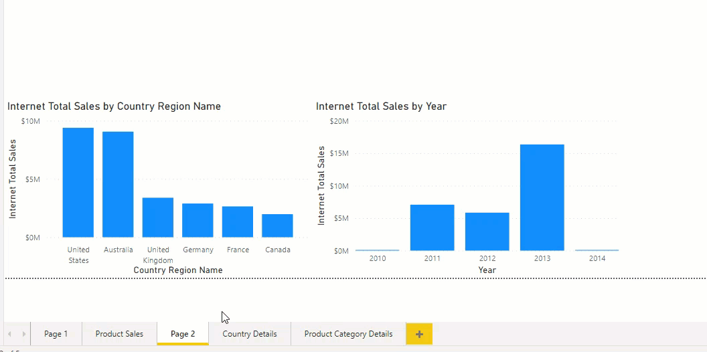
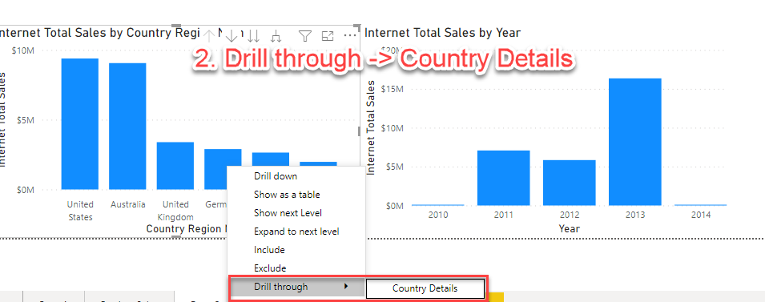
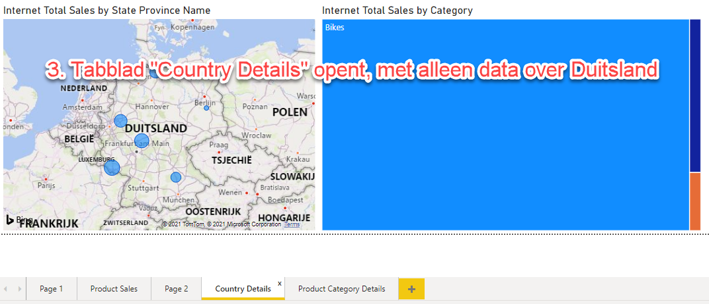
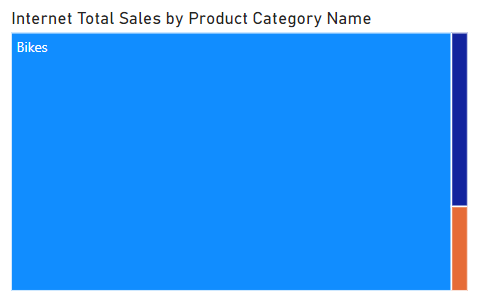
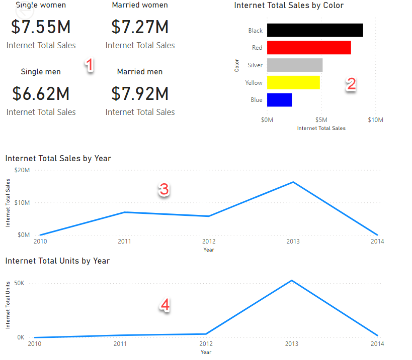
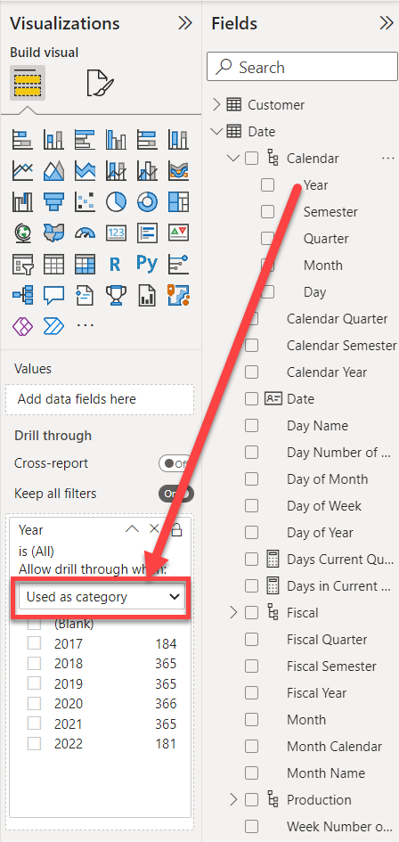
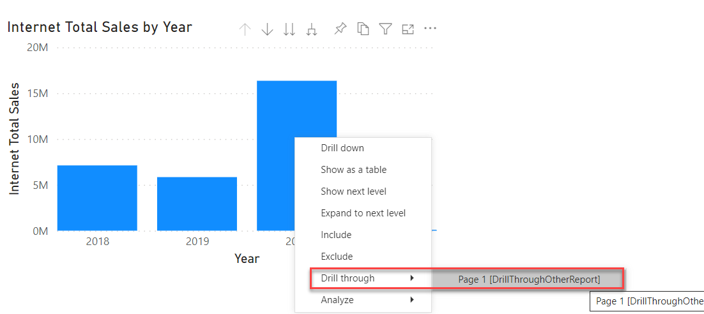

# 04 Drillthrough

Within **Adventure Works**, your manager is particularly pleased with the geographic possibilities of Power BI. However, it is not very useful to repeat all the geographic background information about a region in every report. Ideally, she would like to be able to "click through" to all information about that country in the case of an outlier in sales in a certain country, for example. For example, the trend in sales in recent years, the number of branches in that country, etc.

This "clicking through" is called **drillthrough** in a BI tool. In [module 3](../03-visuals-and-interaction/03-visuals-and-interaction.md) we already looked at the *drilldown*. The *drillthrough* basically means that you take a closer look at a number on another page or in another report. This way you can easily see the context - for example of the sales within a certain country. Below is an example **as it will work at the end of the module** (so you can see how a drillthrough works).

**Notice that you will not yet see this result if you start this lab, this is a preview of what you will achieve at the end**

## Drillthrough within a report

If you want to enable a drillthrough within a report, you must arrange the following:

1. There should be a page stating the *goal* of your drillthrough.
    * In the example above: the "Country Details" page
2. On this *target* page you need to set a "drillthrough filter". In the example above, this is the name of the country: when you come across it somewhere in the report, you can navigate to the drillthrough page in two clicks, which is then automatically filtered by the relevant category.
    * In the example above, the *drillthrough* filter is `Country Region Name`.

### Set up drillthrough in your report

* Open the report 'startpoint-module-4.pbit'
  * If necessary, reselect your own *AdventureWorks* dataset (you also did this in module 3)
* Add a page called "Country Details"
* Add a *map visual* to this (). Configure it as follows:
  * **Location**: **State Province Name** (table *Geography*)
  * **Size**: **Internet Total Sales** (table *Internet Sales*)
* Now also add a so-called "Treemap" for *Internet Total Sales by Product Category Name*:
  * Use the **Product Category Name** field from the **Product Category** table here

* Click anywhere on the canvas so that no more *visual* is selected.
* Under the heading **Drillthrough** you will now find a box "Add drillthrough filters here". Drag the **Country Region Name** field here (table *Geography*)
* Go back to the page *Page 2*, and right click on one of the countries in the chart. You should now have a *Drillthrough* submenu to the *Country Details* page

To top it off, you can now hide the **Country Details** page (right click on the tab, choose **Hide Page**). People viewing your report won't be able to see this page directly.

Now try to create a second drillthrough page "Product Category Details" where you list all data within a product category. Filter based on the **Product Subcategory Name** field (table *Product Subcategory*). Display the following:

*Each point has an extra challenge - you don't have to complete it. However, if everything comes easily to you and you want to push the boundaries of Power BI a little more, give it a shot!*

1. Sell per man / woman / married / unmarried
   * Extra challenge: add corresponding titles within the visual ("Married men", "Single men", etc.)
2. Sell by product color
   * First additional challenge: display only the 5 best selling colors
   * Second extra challenge: let the color be determined by the product color
3. Internet Total Sales per year
4. Internet Total Units per year

If your drillthrough page is working correctly, you should now be able to drillthrough to "Product Category Details" from page "Product Sales"

## Drillthrough between multiple reports

*Drillthrough* is also possible between multiple reports: you can then give the data more depth from a different angle in another report.

To get Drillthrough between multiple reports working we need (at least) two reports:

* The *source report*. This is the report you came from (here you "do" a drillthrough)
* The *target report*. This is the report you end up with after a drillthrough.

Now first create a new report via *File*, *New* that connects to the AdventureWorks dataset in your own workspace and save it under the name *module-4-drillthrough-report*.

In this new report, create a drillthrough filter per **Year** (table *Date*, in the hierarchy *Calendar*). Note that you set here that you should use **Year** as *category*:

You can then choose a year in the list under this setting that you want to display *now* (in fact you filter the data on "only the dates of year X"). As soon as you land on this report via a *drillthrough*, this filter is replaced by the year with which you perform the drillthrough. However, adding this filter will give you a better sense of what the numbers would look like on a drillthrough of (say) 2012.

Then fill the report with insights over a year:

1. The course of sales throughout the year (make sure it is sorted correctly)
2. The ratio of sales to a quarter ago

Then set up the drillthrough reporting:

* In the **source report** (where you start the drillthrough action)
  * **File** -> **Options and settings** -> **Options**
  * Under **Current file**, open **Report settings**
  * Check the checkbox at **Allow visuals in this report to use drillthrough targets from other reports**  

* In the **doel-rapport** (where the drillthrough action will take you):
  * Check the box **Cross-report** under **Drillthrough filter**  

Publish the report, and test whether the drillthrough works across reports in the Power BI Portal.

## Bonus Exercises

### Change the name of the drillthrough action

By default, the drillthrough is titled `Page1 [name-of-source-report]`. Make sure this is replaced by a meaningful name.

## Solution

Here's the endpoint of this lab: [04-01-Solution.pbit](04-01-Solution.pbit) en [04-02-Solution.pbit](04-02-Solution.pbit)

## Video

Here is a [Walkthrough video](https://vimeo.com/584747083/d8e167c13e)

## Next modules

The next module is Module 5: Self-service reporting. We start with [Loading CSV files](../05-self-service-reporting/05-csv-inladen.md). Below is a complete overview of all available modules:

1. [Introduction Power BI Desktop](../01-introduction/01-introduction-powerbi-desktop.md)
2. [Reporting on a Dataset](../02-reporting-on-dataset/02-reporting-on-dataset.md)
3. [Visuals and interaction](../03-visuals-and-interaction/03-visuals-and-interaction.md)
4. [Drillthrough](../04-drillthrough/04-drillthrough.md) (current module)
5. Self-service reporting
   * [Loading CSV files](../05-self-service-reporting/05-csv-inladen.md)
   * [Loading data from SQL Databases](../05-self-service-reporting/06-sql-inladen.md)
6. Data Modeling 101
   * [Relations](../06-data-modeling-101/07-relaties.md)
   * [Cleaning up your Data Model](../06-data-modeling-101/08-opschonen.md)
7. [Introduction to Power Query (GUI)](../07-power-query-gui/09-power-query.md)
8. [Publishing and Collaboration in Workspaces](../08-publishing-and-collaboration-in-workspaces/10-publishing-and-collaboration-in-workspaces.md)
9. [Calculated Columns in DAX](../09-dax/11-calc-columns.md)
