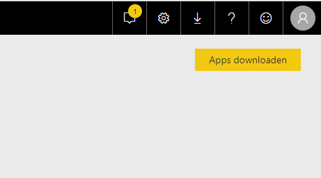

# Publiceren en samenwerken in workspaces

## Publiceren van rapporten

Wanneer je een rapport *publiceert*, komt deze in de online Power BI portal te staan. Deze kun je vinden op [https://app.powerbi.com](https://app.powerbi.com).

* Open het rapport **startpunt-module-4.pbix**
* Onder de **Home** ribbon, klik op **Publish**
* In het venster **Publish to Power BI**, selecteer je **My workspace**. Dit is je eigen privé-omgeving binnen de Power BI-portal, en de plek waar we initieel een rapport gaan plaatsen.

Nadat het rapport geüploadet is, krijg je van Power BI een directe link naar het rapport. Klik op de link *Open 'startpunt-module-4.pbix' in Power BI* om het rapport weer te geven.

Zoals je ziet, kun je het rapport nu vanuit een webbrowser bekijken en gebruiken.

## Dashboards

In de online omgeving van Power BI heb je naast rapporten ook *dashboards* tot je beschikking. Dit zijn door jou samengestelde verzamelingen van diverse *visuals* uit de rapporten die je gepubliceerd hebt. Volg de volgende stappen om een dashboard samen te stellen:

* Met het rapport **startpunt-module-4** geopend op de tab **Page 2**, wijs je met de muis naar **Internet Total Sales by Year**
* Klik op het icoontje van een pin dat onder of boven de grafiek verschijnt (dit is afhankelijk van je browser en schermresolutie):

Power BI vraagt je vervolgens om een dashboard waar hij deze visual kan "vastpinnen". Wanneer je nog geen dashboards hebt, kun je hier enkel *Nieuw dashboard* kiezen.

* Kies **New dashboard**, geef deze de naam **Mijn Dashboard**
* Klik op **Pin**
* Schakel nu naar het tabblad **Product Sales**. Selecteer hier op de kaart de regio Australië.
* **Pin** nu de grafiek **Internet Total Sales per Product Subcategory Name** aan het zojuist aangemaakte dashboard.

* Open nu **My Workspace**
* Bovenaan onder **Dashboards** staat nu **Mijn Dashboard**. Klik hierop.

Zoals je ziet, worden de visuals weergegeven op de manier waarop je ze in het rapport zag op het moment dat je ze vastpinde. De **Internet Total Sales per product subcategory name** heeft dus een gefilterde weergave. De inhoud wordt echter wel bijgewerkt wanneer de achterliggende data wijzigt.

Het dashboard bestaat uit zogenaamde "tiles" of "tegels". Dit zijn niet alleen de visuals, maar ook andere tegels die je kunt toevoegen. Bijvoorbeeld via de knop "Tegel toevoegen"in het menu "Bewerken":

* Probeer nu het dashboard af te maken zodat het er als volgt uitziet.
* De URL van het plaatje dat hier gebruikt is, is [http://www.slate.com/content/dam/slate/blogs/future_tense/2015/09/01/google_s_new_animated_logo_is_the_future_of_mobile_branding/google_logo.gif.CROP.original-original.gif](http://www.slate.com/content/dam/slate/blogs/future_tense/2015/09/01/google_s_new_animated_logo_is_the_future_of_mobile_branding/google_logo.gif.CROP.original-original.gif).

## Aanmaken van workspaces

Om samen aan rapporten te kunnen werken, kun je in de Power BI portal zogenaamde "workspaces" of "werkruimten" maken.

* Klik op "Workspaces"
* Klik "Create a workspace"

> Het venster **Upgrade to Power BI Pro** komt nu naar boven. Kies hier voor **Try Pro for free** - je kunt dan 60 dagen lang gebruik maken van de features van Power BI Pro.

* Geef de werkruimte een creatieve naam

In de werkruimte kun je ook mede-cursisten toevoegen om je werk te delen. Dit is enigszins vergelijkbaar met hoe Office 365-groepen werken. In het verleden was elke Power BI-groep ook automatisch een Office 365-groep - sinds april 2019 is dit echter verleden tijd en worden Power BI groepen apart beheerd binnen de Power BI portal.

## Uploaden en downloaden binnen een workspace

We gaan nu Power BI-rapporten uploaden en delen met collega's. Omdat iedereen echter exact hetzelfde rapport heeft met exact dezelfde naam, gaan we ze eerst duidelijk herkenbaar maken. Dit hoef je uiteraard bij je "echte" Power BI-gebruik niet te doen, maar is voor dit stukje van de cursus wel zo duidelijk:

* Open Power BI Desktop
* Sla het bestand 'startpunt-module-4' op onder een andere naam (bijvoorbeeld iets met je eigen naam erin).
* Publiceer het bestand naar de werkruimte die je zojuist hebt aangemaakt  

* Probeer of je enkele mede-cursisten kunt toevoegen aan je werkruimte, en kijk rond in de werkruimtes van mede-cursisten waar jij wordt toegevoegd.
  * Het zou kunnen dat je Power BI opnieuw moet opstarten, voordat Power BI je (zojuist aangemaakte) Pro-trial herkent. Deze licentie heb je nodig om te mogen publiceren naar een *workspace*.
* Download een rapport van een mede-cursist, maak wat mooie aanpassingen, en publiceer het opnieuw naar zijn/haar werkruimte.

> Wat je zojuist gedaan hebt, is het **samenwerken** - dit is voor de "achterkant" van Power BI: de mensen die je rechten wilt geven om jouw rapporten te bewerken, voeg je hier toe. Samen met hen ben je dan verantwoordelijk voor het *bouwen* van rapporten.

## Publiceren van een "App"

De samenwerkingsmogelijkheden in workspaces zijn gericht op rapport-ontwikkelaars. Het is echter niet handig om deze direct met alle eindgebruikers te delen:

* Workspaces zijn niet al te (eind)gebruiksvriendelijk: je moet eerst naar een "workspace", om daar het juiste rapport aan te klikken.
* Workspaces zijn ook niet heel handig wanneer je (als eindgebruiker) veel rapporten afneemt van diverse teams: dan zou je alle workspaces door moeten op zoek naar de rapporten die je nodig hebt
* Delen met een eindgebruiker via een workspace beperkt je als rapport-eigenaar / -ontwikkelaar in je mogelijkheden: als je een nieuwe pagina aan het ontwikkelen bent (waarvan de data wellicht nog niet 100% correct is), ziet de eindgebruiker direct alle wijzigingen.

Om op een nette, eenvoudige en stabiele manier rapporten met eindgebruikers te delen heeft Microsoft de zogenaamde "Power BI Apps" gemaakt. Dit houdt in dat je als rapport-eigenaar een rapport kunt *publiceren* als ware het een app, waarna de eindgebruiker *binnen de Power BI portal* deze weer kan "ophalen". Globaal ziet dat er als volgt uit:

1. Je werkt met collega's aan een rapport in een werkruimte
2. Je bereikt een "stabiele versie" die je wilt gaan delen met je eindgebruikers
3. *Je publiceert nu de werkruimte als een "app"*
4. Je kunt nu doorgaan met ontwikkelen in de werkruimte: dit heeft geen invloed op de "gepubliceerde" app.
5. De eindgebruiker haalt de app op, en doet analyses
6. Zodra je een nieuwe(re) versie van een rapport wilt publiceren, publiceer je de app opnieuw. De eindgebruiker krijgt nu automatisch de nieuwste versie van het rapport.

* Open nu de werkruimte die je eerder hebt aangemaakt
* Rechtsklik bovenin op de knop "App maken"

* Voer een beschrijving in van de app
* Schakel naar het tabblad **Navigation**
  * Zoals je ziet, staat er momenteel slechts één rapport in deze workspace. Wanneer dit er meer waren zijn, kun je hier een eenvoudige navigatie toevoegen.
* Schakel naar het tabblad **Permissions**
* Wijs één of meer collega's binnen de cursus aan die jouw "app" mogen gaan gebruiken.
* Publiceer de app

### Gebruikmaken van een gepubliceerde app

* Schakel nu naar het onderdeel **Apps** in het menu aan de linkerzijde van de Power BI Portal

Dit is de weergave voor de gebruikers van Power BI apps. Als je een app publiceert, ben je zelf automatisch ook gebruiker, zodat je goed kunt zien hoe de app er voor je eindgebruikers uit zou zien.

* Selecteer de gele knop "Get apps" (in het Nederlands is deze knop een beetje gek vertaald met "Apps downloaden")

* Selecteer in het venster de app die je zojuist hebt toegevoegd door op de blauwe tekst "Get it now" / "Nu downloaden" te klikken.
* Je app is nu toegevoegd aan het menu met Apps.
* Klik op een app om het achterliggende rapport automatisch te openen
* Probeer ook enkele apps van collega's te openen

Zoals hierboven verteld, zijn de wijzigingen die je in de workspace maakt niet zichtbaar voor eindgebruikers zolang je de app niet publiceert.

Test dit:

* Maak wat wijzigingen in je rapport
* Publiceer het opnieuw naar je eigen workspace
* Kijk bij jezelf en/of bij een collega die de app gebruikt of de wijzigingen inderdaad verborgen blijven
* Publiceer de app workspace
* Controleer of de wijzigingen inderdaad doorkomen

## Volgende modules

De volgende module is [CSV-bestanden inladen](../06-self-service-reporting/06-csv-inladen.md). Hieronder vind je een overzicht van alle modules:

### Week 1

1. [Introductie Power BI Desktop](../01-introduction/01-introduction-powerbi-desktop.md)
2. [Rapporteren op kubus-data en eerste visualisatie](../02-reporting-on-cube-data/02-reporting-on-cube-data.md)
3. [Visuals en interactie](../03-visuals-and-interaction/03-visuals-and-interaction.md)
4. [Drillthrough](../04-drillthrough/04-drillthrough.md)

### Week 2

5. [Publiceren en samenwerken in workspaces](../05-publishing-and-collaboration-in-workspaces/05-publishing-and-collaboration-in-workspaces.md) (huidige module)
6. Self-service reporting
   * [CSV-bestanden inladen](../06-self-service-reporting/06-csv-inladen.md)
   * [SQL data inladen](../06-self-service-reporting/07-sql-inladen.md)
7. Data Modeling 101
   * [Relaties](../07-data-modeling-101/08-relaties.md)
   * [Opschonen van je datamodel](../07-data-modeling-101/09-opschonen.md)
8. [Introductie Power Query (GUI)](../08-power-query-gui/11-power-query.md)
