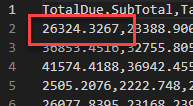
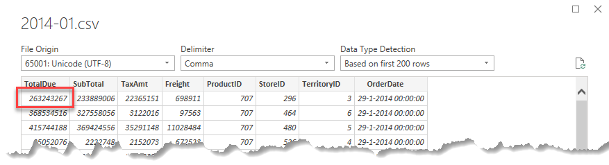
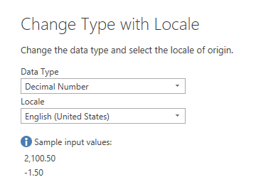
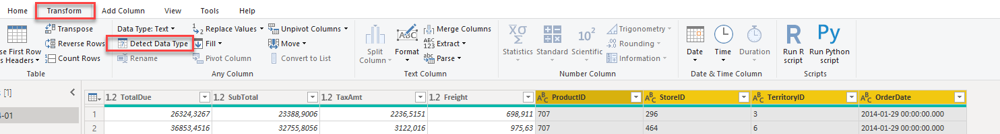
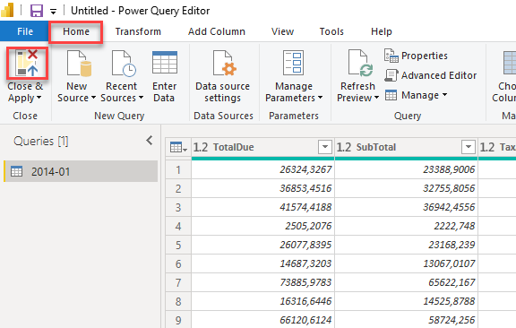
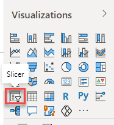
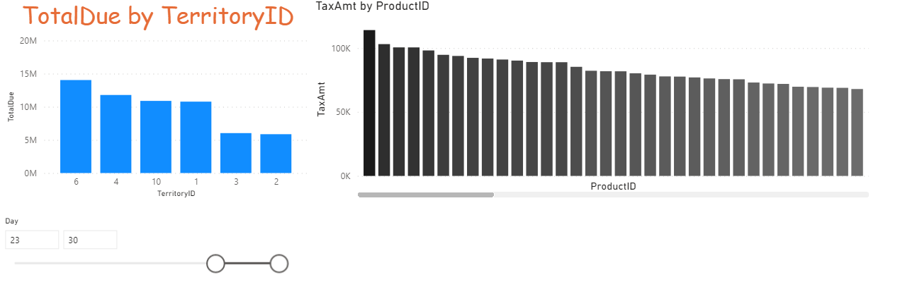

# 05-01 Self Service Reporting part 1: Loading CSV data

A lot of data is present within the AdventureWorks Data Warehouse, but not all data. It turns out that for specific historical sales figures from 2014 there is still extra data from an old system that is not present in the Data Warehouse. The management department has now made CSV exports of this, in the hope that you can make these transparent in a report.

In this module we load CSV data. There is little knowledge about data types in a CSV file, for example. But the way in which data is stored in a CSV file can also differ. That is why you can sometimes run into challenges here. That is why we are already looking a little bit at Power Query to tackle these challenges. Finally, we make a first visualization on this new data.

## Preparation

Start Power BI Desktop with a new, empty report.

## CSV-Data inladen

1. To load a CSV-file select **Get Data** -> **Text/CSV**

2. Selecteer the file ["2014-01.csv"](csv/2014-01.csv) from the "csv" folder.

Power BI now estimates the structure of the CSV file. However, CSV is not the most obvious data type.
For example, when we look in the CSV file, on line 1 we see the number 26324.3267

What does 26324.3267 mean?

* Is it 263 million (263,243,267)?
* Is it 26 thousand (26.324,3267)?

Power BI makes an assumption based on the Windows locale settings: in a Belgian or Dutch Windows installation it will make the assumption that a dot is a thousands separator, and a comma is the decimal separator. But this CSV file comes from an English software package, so that is not correct:

3. Click on **Transform Data** at the bottom of the window to adjust this.

The Power Query window will now open.

On the right-hand side, under **Applied steps**, you can see the steps Power BI has taken to process your CSV file.

4. Under the **applied steps**, click on the different steps, from top to bottom.
   * View what changes happened when loading the CSV.
   * What's going wrong?
4. Remove the **Changed Type** step by clicking the cross next to it.

By removing the **Changed Type** step we have discarded the information about *datatypes*. Power BI no longer knows what a number or a date is and classifies everything as text. You can also see this by the **ABC** icon above your columns:

6. Now select the first four columns: **TotalDue**, **SubTotal**, **TaxAmt** and **Freight**
   * You can select multiple columns by holding down the **Ctrl** key on your keyboard

As you saw earlier, Power BI interpreted the numbers (incorrectly) by using the country and region settings from Windows. In English, these settings are called *Locale*. We are therefore going to tell Power BI again how to interpret this data, but now with the correct region settings / *Locale*.

7. Right click on one of the columns and choose **Change Type** -> **Using Locale...**

8. Select:
   * **Data Type**: **Decimal Number**
   * **Locale**: **English (United States)**

Under *Sample input values:* Power BI displays how the data is expected to be formatted:

9. Select all other columns:
   * ProductID
   * StoreID
   * TerritoryID
   * OrderDate
9. On the ribbon, under **Transform**, select **Detect Data Type**

Power BI now recognizes what kind of data is in it based on the content of the other columns.

11. Select **Close & Apply** on the ribbon under **Home** to load the CSV data.

## Explore dates

On the right side you will now see a table "2014-01", with some fields below it. At the moment there is not a lot of useful information in the data model: data from one period from 2014 is available, but all references to shops, products and sales areas are only technical keys (the columns that an underwater database uses to uniquely identify rows). - in this case e.g. `TerritoryID` and `ProductID`).

Now create three Power BI visualizations. Make sure that the "per" fields (*per* TerritoryID for example) below are not summed, but neatly split! Use the standard bar charts, and make the corresponding changes

1. **TotalDue** per **TerritoryID**
    * Set the title of the chart:
      * centered
      * red
      * font Comic Sans, 24pt (*let this be the last time you use Comic Sans in a data visualization*)
    * For **TerritoryID**, add a **Top 6 filter**, based on **TotalDue**
    * Change the X-axis from **Continuous** to **Categorical**
    * Add a title to the X-axis
2. **TaxAmt** per **ProductID**
    * Make the X-axis **Categorical**, then turn it off
    * Set as **Data colors** a **Conditional formatting** (hint: click on the dots to *Default color*)
      * Set the minimum color to the lightest shade of gray within the theme colors
      * Set the maximum color to the darkest shade of gray (not black) within the theme colors
      * Leave the other settings as default
      * Click "OK"
3. Add a **slicer** for the **Day** field

> When you view the file ["2014-01.csv"](csv/2014-01.csv) in a text editor (for example in *Notepad*), you will see that the *Day* field is not present. Power BI saw here that we had a date field in the source data, and added a hierarchy (Year, Quarter, Month, Day) to this for us.
>
> Handy, because we analyse our data often over time, but we rarely need the date level directly!

Below you can see a possible outcome.

**Save the file - we'll continue with this in the next section**.

## Solution

Here's the endpoint of this lab: [05-01-Solution](05-01-Solution.pbix)

## Video

Here is a [Walkthrough video](https://vimeo.com/584747225/22f90d1d60)

## Next modules

Within this area about Self-service reporting, the next module is [Loading data from SQL Databases](../05-self-service-reporting/06-sql-inladen.md). Below is a complete overview of all available modules:

1. [Introduction Power BI Desktop](../01-introduction/01-introduction-powerbi-desktop.md)
2. [Reporting on a Dataset](../02-reporting-on-dataset/02-reporting-on-dataset.md)
3. [Visuals and interaction](../03-visuals-and-interaction/03-visuals-and-interaction.md)
4. [Drillthrough](../04-drillthrough/04-drillthrough.md)
5. Self-service reporting
   * [Loading CSV files](../05-self-service-reporting/05-csv-inladen.md) (current module)
   * [Loading data from SQL Databases](../05-self-service-reporting/06-sql-inladen.md)
6. Data Modeling 101
   * [Relations](../06-data-modeling-101/07-relaties.md)
   * [Cleaning up your Data Model](../06-data-modeling-101/08-opschonen.md)
7. [Introduction to Power Query (GUI)](../07-power-query-gui/09-power-query.md)
8. [Publishing and Collaboration in Workspaces](../08-publishing-and-collaboration-in-workspaces/10-publishing-and-collaboration-in-workspaces.md)
9. [Calculated Columns in DAX](../09-dax/11-calc-columns.md)
