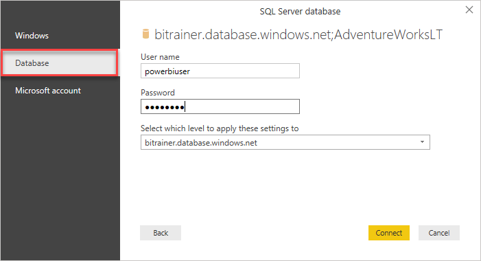

# 05-02 SQL-bronnen inladen

De CSV-data uit de vorige opdracht was niet heel nuttig: er zat veel technische data in, en miste wat context. Het blijkt echter dat ook deze context niet in het Data Warehouse ontsloten is. En aangezien we wel graag snel enkele inzichten hierover willen, moeten we verder zoeken. We komen uit bij twee operationele bronsystemen, waar de data voor ons beschikbaar is.

## Voorbereiding

We gaan verder met het rapport dat we op een CSV-bestand hebben gebouwd.

Alternatief als je de vorige opdracht niet correct hebt afgerond:

**Open** het bestand [05-01-Solution](../05-self-service-reporting/05-01-Solution.pbix)

## Inladen van SQL-data

Om de data nu nuttiger te maken, gaan we er data uit andere tabellen aan toevoegen. 

1. Maak hiervoor verbinding met de **SQL Database** die op Azure staat:
   * Adres: wortellsmartlearning.database.windows.net
   * Database: AdventureWorks2019
1. Laat de Data Connectivity mode op "Import" staan:
   
 
In het volgende venster word je gevraagd hoe je verbinding met deze database wilt maken.

{:start="3"}
3. Kies voor een **Database** login en vul de volgende login-gegevens in:
   * User: PowerBIUser
   * Password: PowerBI2  
   

Het venster "Navigator" opent. Je ziet nu eerst een lijst van _views_, daaronder de _tabellen_ en uiteindelijk _table-valued functions_. Merk op dat hier verschillende icoontjes voor zijn! 

{:start="4"}
4. Selecteer de volgende _tabellen_:
   * Person.CountryRegion
   * Sales.SalesTerritory
   * Production.Product
   * Production.ProductSubcategory
   * Production.ProductCategory

Je kunt hier de zoekfunctie voor gebruiken:

{:start="5"}
5. Klik op **Load** om de data in te laden.

Vervang nu in de rapportage de TerritoryID met de kolom "Name" uit SalesTerritory. Vervang ProductID door de kolom "Name" uit ProductCategory. Zet de weergave van de X-as weer aan voor deze grafiek.

> **Let op!** Zoals je ziet wordt voor elke regio en productcategorie exact hetzelfde bedrag weergegeven. Wanneer dit het geval is, is er meestal iets mis in je datamodel.
>
> In de volgende module zullen we hier oplossingen voor vinden.

In een ander bronsysteem hebben we ook wat informatie over winkels verzameld. Deze data gaan we nu inladen.

* server: wortellsmartlearning.database.windows.net
* database: AdventureWorksLT
* tabel: SalesLT.Store

Probeer nu de vrachtkosten per winkel weer te geven. Dit doe je door in het rapport een Tabel visualisatie toe te voegen met daarin de volgende twee velden:

1. SalesLT Store -> Name
2. 2014-01 -> Freight

Zoals je ziet wordt ook hier voor elke winkel exact hetzelfde bedrag aan vrachtkosten ("freight") weergegeven, **maar ook dat het totaal exact hetzelfde is**. Dit geeft opnieuw aan dat tussen deze velden (`'Sales LT Store'[Name]` en `'2014-01'[Freight]`) geen relatie bestaat. In een volgende module kijken we hoe we deze relatie kunnen vormgeven.

## Oplossing

Hier vind je het eindpunt van deze opdracht: [05-02-Solution](../05-self-service-reporting/05-02-Solution.pbix)

## Video

Hier vind je de [Walkthrough video](https://vimeo.com/584747225/22f90d1d60)

## Volgende modules

De volgende module is Module 6: Data Modeling 101. Het eerste onderwerp hier is [Relaties](../06-data-modeling-101/07-relaties.md).

Hieronder vind je een overzicht van alle modules:

1. [Introductie Power BI Desktop](../01-introduction/01-introduction-powerbi-desktop.md)
2. [Rapporteren op Power BI Datasets en eerste visualisatie](../02-reporting-on-dataset/02-reporting-on-dataset.md)
3. [Visuals en interactie](../03-visuals-and-interaction/03-visuals-and-interaction.md)
4. [Drillthrough](../04-drillthrough/04-drillthrough.md)
5. Self-service reporting
   * [CSV-bestanden inladen](../05-self-service-reporting/05-csv-inladen.md)
   * [SQL data inladen](../05-self-service-reporting/06-sql-inladen.md) (huidige module)
6. Data Modeling 101
   * [Relaties](../06-data-modeling-101/07-relaties.md)
   * [Opschonen van je datamodel](../06-data-modeling-101/08-opschonen.md)
7. [Introductie Power Query (GUI)](../07-power-query-gui/09-power-query.md)
8. [Publiceren en samenwerken in workspaces](../08-publishing-and-collaboration-in-workspaces/10-publishing-and-collaboration-in-workspaces.md)
9. [Calculated Columns met DAX](../09-dax/11-calc-columns.md)
