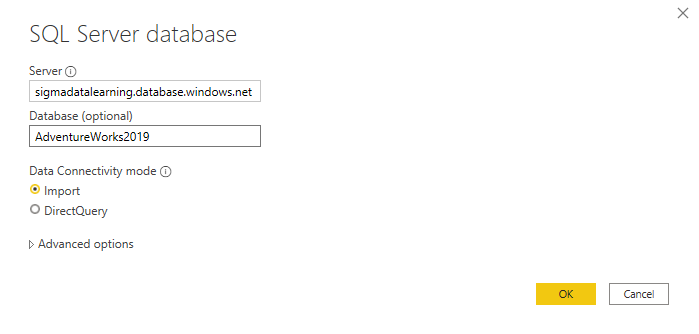
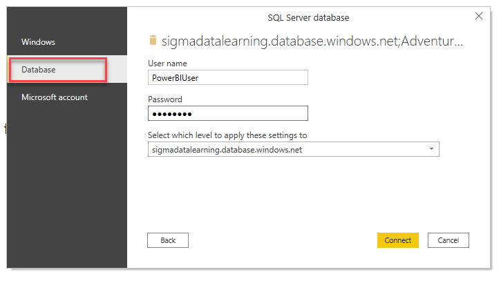
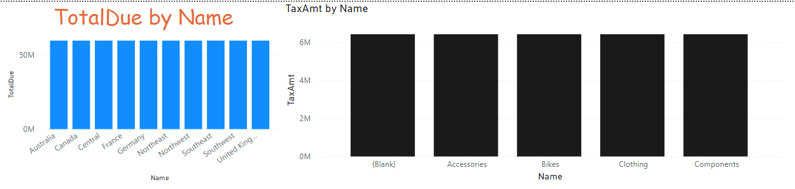

# 05-02 Load data from SQL sources

The CSV data from the previous assignment was not very useful: it contained a lot of technical data and lacked some context. However, it appears that this context is not accessible in the Data Warehouse either. And since we would like some quick insights about this, we have to look further. We arrive at two operational source systems, where the data is available to us.

## Preparation

Let's continue with the report we built on a CSV file.

Alternatively if you didn't complete the previous assignment correctly:

**Open** the file [05-01-Solution](../05-self-service-reporting/05-01-Solution.pbix)

## Loading SQL data

Now to make the data more useful, let's add data from other tables.

1. To do this, connect to the **SQL Database** that is on Azure:
    * Address: wortellsmartlearning.databas.windows.net
    * Database: AdventureWorks2019
1. Leave the Data Connectivity mode on "Import":
   

In the next window you will be asked how you want to connect to this database.

3. Choose a **Database** login and fill in the following login details:
   * User: PowerBIUser
   * Password: PowerBI2
   

The "Navigator" window opens. You will now first see a list of _views_, below that the _tables_ and finally _table-valued functions_. Note that there are different icons for this!

4. Select the following _tables_:
   * Person.CountryRegion
   * Sales.SalesTerritory
   * Production.Product
   * Production.ProductSubcategory
   * Production.ProductCategory

You can use the search function for this:

5. Click on **Load** to load the data.
5. Replace the TerritoryID in the report with the column "Name" from SalesTerritory.
5. replace ProductID with the column "Name" from ProductCategory. 
5. Turn the X-axis display back on for this graph.

> ### Automagic
>
> Power BI has created a few relationships for you here, so that the data you just loaded could be linked to the data that came from a CSV file. Power BI does this based on the column names, and based on their contents (all values from column A in table 1 must appear exactly once in column A in table 2).
>
> If you find it interesting, you try to find out between which columns the relationship is made and which "direction" it has.

In another source system, we also collected some information about stores. We are now going to load this data.

* server: wortellsmartlearning.databas.windows.net
* database: AdventureWorksLT
* table: SalesLT.Store

Try to display the freight cost per store. You do this by adding a Table visualization in the report containing the following two fields:

1. SalesLT.Store -> Name
2. 2014-01 -> Freight

As you can see, exactly the same amount of freight ("freight") is displayed for each store. This is obviously not correct!
It indicates that there is no relationship between these fields (`'Sales LT Store'[Name]` and `'2014-01'[Freight]`). In the next module we will look at how we can shape this relationship.

## Solution

Here's the endpoint of this lab: [05-02-Solution](../05-self-service-reporting/05-02-Solution.pbix)

## Video

Here is a [Walkthrough video](https://vimeo.com/584747225/22f90d1d60)

## Next modules

The next module is Module 6: Data Modeling 101. We start with [Relations](../06-data-modeling-101/07-relaties.md). Below is a complete overview of all available modules:

1. [Introduction Power BI Desktop](../01-introduction/01-introduction-powerbi-desktop.md)
2. [Reporting on a Dataset](../02-reporting-on-dataset/02-reporting-on-dataset.md)
3. [Visuals and interaction](../03-visuals-and-interaction/03-visuals-and-interaction.md)
4. [Drillthrough](../04-drillthrough/04-drillthrough.md)
5. Self-service reporting
   * [Loading CSV files](../05-self-service-reporting/05-csv-inladen.md)
   * [Loading data from SQL Databases](../05-self-service-reporting/06-sql-inladen.md) (current module)
6. Data Modeling 101
   * [Relations](../06-data-modeling-101/07-relaties.md)
   * [Cleaning up your Data Model](../06-data-modeling-101/08-opschonen.md)
7. [Introduction to Power Query (GUI)](../07-power-query-gui/09-power-query.md)
8. [Publishing and Collaboration in Workspaces](../08-publishing-and-collaboration-in-workspaces/10-publishing-and-collaboration-in-workspaces.md)
9. [Calculated Columns in DAX](../09-dax/11-calc-columns.md)
