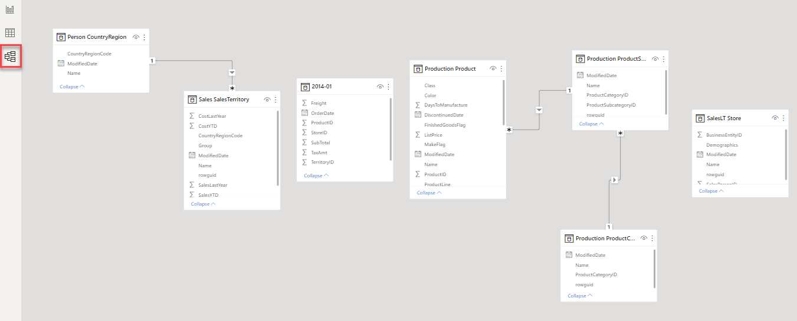
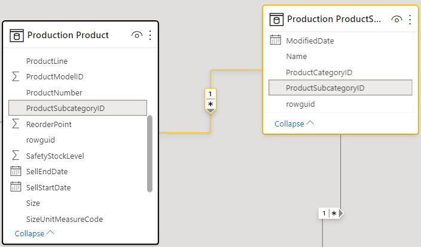

# 06-01 Relationships

In the previous module we saw that a relationship was missing between the table *Store* (in which the stores are located) and the table *2014-01* (in which the sales from 2014 are supplied).

## Preparation

Let's continue with the report we built on a CSV file.

Alternatively if you didn't complete the previous assignment correctly:

**Open** [05-02-Solution](../05-self-service-reporting/05-02-Solution.pbix)

## Creating Relationships

To create relationships, switch to the "Model" view.

As you can see, there are several relationships, represented by lines between the tables. When you click on a relation, you can see how the relation runs and which columns refer to each other. There are three important characteristics in a relationship:

1. the "1" side
2. the "*" side (this is called the "many" side)
3. the filter direction

In the picture above:

* The relationship is between *Production ProductSubcategory* and *Production Product*
* The relationship is on both sides on the *ProductSubcategoryID* column
* The *ProductSubcategoryID* column is unique within the *Production Product* table (indicated by the "1" in the relationship)
* When you filter the *Production ProductSubcategory* table (for example, by clicking on a subcategory in a report), this filter continues to work in the list of displayed products.

Try the filtering in the Report view of Power BI. Does it work as expected?

A relationship is currently missing between the "2014-01" table and the "Store" table. Create this by dragging the column "BusinessEntityID" from "Store" and dropping it above the column "StoreID" in the table "2014-01":

Now return to the "report" view and verify that the display of freight charges per store is correct.

## Solution

Here's the endpoint of this lab: [06-01-Solution](06-01-Solution.pbix)

## Video

Here is the [Walkthrough video](https://vimeo.com/584747355/e3b8b0302a)

## Next modules

The next module is [Module 7: Introduction to Power Query (GUI)](../07-power-query-gui/09-power-query.md). Below is a complete overview of all available modules:

1. [Introduction Power BI Desktop](../01-introduction/01-introduction-powerbi-desktop.md)
2. [Reporting on a Dataset](../02-reporting-on-dataset/02-reporting-on-dataset.md)
3. [Visuals and interaction](../03-visuals-and-interaction/03-visuals-and-interaction.md)
4. [Drillthrough](../04-drillthrough/04-drillthrough.md)
5. Self-service reporting
   * [Loading CSV files](../05-self-service-reporting/05-csv-inladen.md)
   * [Loading data from SQL Databases](../05-self-service-reporting/06-sql-inladen.md)
6. Data Modeling 101
   * [Relations](../06-data-modeling-101/07-relaties.md) (current module)
   * [Cleaning up your Data Model](../06-data-modeling-101/08-opschonen.md)
7. [Introduction to Power Query (GUI)](../07-power-query-gui/09-power-query.md)
8. [Publishing and Collaboration in Workspaces](../08-publishing-and-collaboration-in-workspaces/10-publishing-and-collaboration-in-workspaces.md)
9. [Calculated Columns in DAX](../09-dax/11-calc-columns.md)
