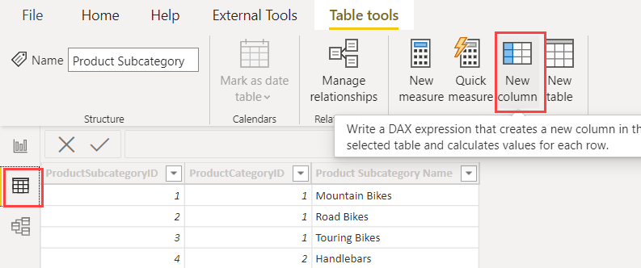
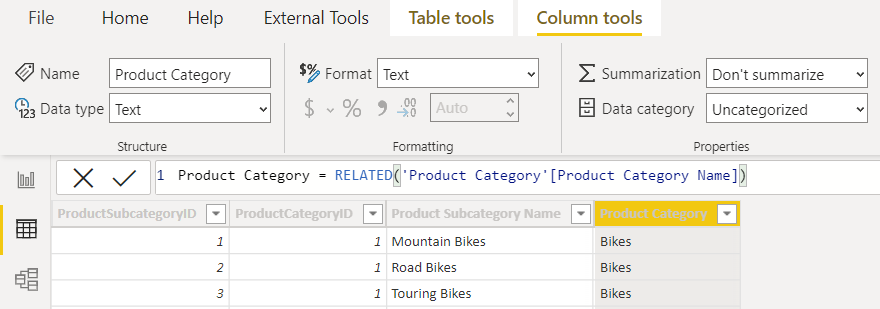

# 06-02 Improving your Dataset: Cleaning your Data Model; introduction of Calculated Columns

With all relations in place, we can perform all kinds of analyzes on this data model. Before we continue, however, let's make a short stop: could we perhaps make this model a bit more user-friendly?

## Preparation

Let's continue with the report we built on a CSV file.

Alternatively if you didn't complete the previous assignment correctly:

**Open** [06-01-Solution](06-01-Solution.pbix)

## Cleaning your model and calculated columns

In order to make the current model - which comes directly from a "3NF" source system - more readable, we can apply some fixes easily:

* Assign meaningful names to tables and columns
* Remove unnecessary fields
* Hide technical fields (like ID fields)
* Reduce number of levels in tables

## Basic cleaning of the data model

To keep the model more readable, we can remove or hide unnecessary columns.

* Deleting a column removes it from the data model.
  * The column then no longer takes up space.
  * We do this, for example, for unused columns that have no relevant meaning for us, or columns that take up a lot of space, such as:
    * XML data
    * Globally Unique IDentifiers (GUID fields)
    * Pictures
* When hiding a column, it is invisible to a user by default.
  * This makes the model more accessible, but keeps the columns available.
  * This is useful, for example, for ID columns: they have no meaning, but are important to establish a relationship, for example.

To make the model more readable, do the following:

* Rename the tables
  * Person CountryRegion -> Country-Region
  * Sales Sales Territory -> Sales Territory
  *Production Product -> Product
  * Production Product Subcategory -> Product Subcategory
  *Production ProductCategory -> Product Category
  * "2014-01" -> Sales
* Rename the columns "Name" in each table so that it is clear what name something is
  * E.g. in the table "Store" the column "Name" -> "Store Name"
* Rename the column "Group" in the table "Sales Territory" to "Sales Territory Group"
* Hide all ID columns
* Remove columns with XML and GUID data, and columns named "ModifiedDate"

## Calculated Columns

In the "Data" view of Power BI, you can easily view what data is currently in the data model.

We can add columns here that are filled based on a DAX expression. We call this "Calculated Columns".

* Add a new column to the "ProductSubcategory" table

* Manually type the expression below:
* Expression: `Product Category = RELATED('Product Category'[Product Category Name])`

* Now hide the entire table ProductCategory

Now when you go to the Report view, you will see that there is one less table, and the name of a product category is displayed under the table Product Subcategory. It has a small "F(x)" sign next to it to indicate that it is a calculated column.

* Repeat the above steps to now include the names of both the *product category* and the *product subcategory* directly in the *Product* table. Also hide the table *Product Subcategory*
* Similarly, add the name from *Country-Region* to *Sales Territory*, and hide the *Country-Region* table

As you can see, this makes it relatively easy to "flatten" your model and make it more accessible to Power BI users.

## Solution

Here's the endpoint of this lab: [06-02-Solution](06-02-Solution.pbix)

## Video

Here is the [Walkthrough video](https://vimeo.com/584747355/e3b8b0302a)

## Next modules

The next module is [Module 7: Introduction to Power Query (GUI)](../07-power-query-gui/09-power-query.md). Below is a complete overview of all available modules:

1. [Introduction Power BI Desktop](../01-introduction/01-introduction-powerbi-desktop.md)
2. [Reporting on a Dataset](../02-reporting-on-dataset/02-reporting-on-dataset.md)
3. [Visuals and interaction](../03-visuals-and-interaction/03-visuals-and-interaction.md)
4. [Drillthrough](../04-drillthrough/04-drillthrough.md)
5. Self-service reporting
   * [Loading CSV files](../05-self-service-reporting/05-csv-inladen.md)
   * [Loading data from SQL Databases](../05-self-service-reporting/06-sql-inladen.md)
6. Data Modeling 101
   * [Relations](../06-data-modeling-101/07-relaties.md)
   * [Cleaning up your Data Model](../06-data-modeling-101/08-opschonen.md) (current module)
7. [Introduction to Power Query (GUI)](../07-power-query-gui/09-power-query.md)
8. [Publishing and Collaboration in Workspaces](../08-publishing-and-collaboration-in-workspaces/10-publishing-and-collaboration-in-workspaces.md)
9. [Calculated Columns in DAX](../09-dax/11-calc-columns.md)
