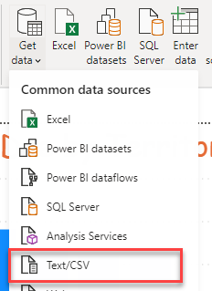
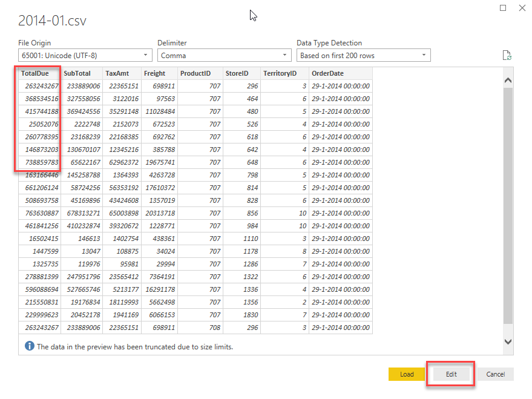
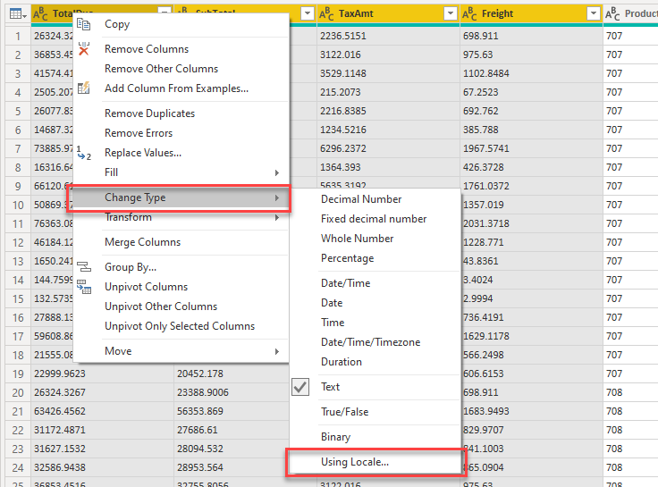
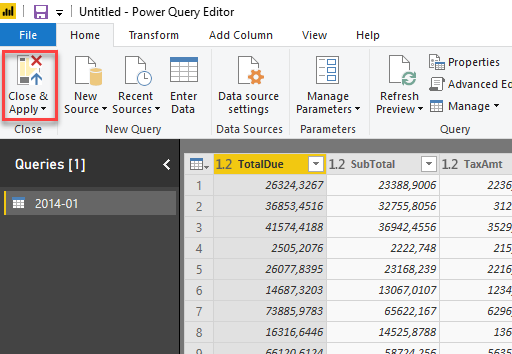
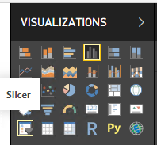

# CSV-data inladen, introductie Power Query en eerste visualisatie

Binnen het AdventureWorks Data Warehouse is veel data aanwezig, maar niet alle data. Het blijkt dat voor specifieke historische verkoopcijfers uit 2014 er nog extra data uit een oud systeem zijn, die niet in het Data Warehouse aanwezig zijn. Nu heeft de beheer-afdeling CSV-exports hiervan gemaakt, in de hoop dat jij deze inzichtelijk kunt maken in een rapport.

In deze module laden we CSV-data in. In een CSV-bestand is weinig kennis over bijvoorbeeld datatypes. Maar ook de manier waarop gegevens in een CSV-bestand opgeslagen staat kan verschillen. Daarom kun je hier soms tegen uitdagingen aanlopen. We kijken daarom alvast een klein beetje naar Power Query om deze uitdagingen het hoofd te bieden. Ten slotte maken we een eerste visualisatie op deze nieuwe data.

## Voorbereiding

Start Power BI Desktop met een nieuw, leeg rapport.

## CSV-Data inladen

1. Om een CSV-bestand in te laden ga je naar **Get Data** -> **Text/CSV**

2. Selecteer het bestand ["2014-01.csv"](csv/2014-01.csv) uit de map "csv".

Power BI maakt nu een inschatting van de structuur van het CSV-bestand. CSV is echter niet het meest duidelijke datatype. 
Wanneer we bijvoorbeeld in het CSV-bestand kijken, zien we daar op regel 1 het getal 26324.3267

Wat betekent 26324.3267?

* Is het 263 miljoen (263.243.267)?
* Is het 26 duizend (26.324,3267)?

Power BI maakt een aanname op basis van de landinstellingen van Windows: in een Nederlandse Windows-installatie zal hij de aanname maken dat een punt een duizendtalscheiding is, en een komma de scheiding decimale waarden. Maar dit CSV-bestand is afkomstig uit een Engelstalig softwarepakket, dus die vlieger gaat niet op:

3. Klik daarom onderin het venster op **Transform Data** om dit aan te passen.

Het Power Query venster opent zich nu.

Aan de rechterzijde zie je onder **Applied steps** de stappen die Power BI heeft genomen om je CSV-bestand te verwerken.

4. Klik onder de **applied steps** op de verschillende stappen, van boven naar beneden.
   * Bekijk wat voor wijzigingen er zijn gebeurd bij het inladen van de CSV.
   * Waar gaat het mis?
5. Verwijder de **Changed Type** stap door op het kruisje ernaast te klikken.

Met het verwijderen van de **Changed Type** stap hebben we de informatie over *datatypes* weggegooid. Power BI weet nu niet meer wat een getal of een datum is, en classificeert alles als tekst. Dit kun je ook zien aan het **ABC** icoontje boven je kolommen:

6. Selecteer nu de eerste vier kolommen: **TotalDue**, **SubTotal**, **TaxAmt** en **Freight**
   * Je kunt meerdere kolommen selecteren door de **Ctrl**-toets ingedrukt te houden op je toetsenbord

Zoals je eerder zag, interpreteerde Power BI de getallen (incorrect) door de instellingen voor land en regio vanuit Windows te gebruiken. In het Engels worden deze instellingen *Locale* genoemd. We gaan daarom Power BI opnieuw vertellen hoe deze data geïnterpreteerd moet worden, maar nu met de juiste regio-instellingen / *Locale*.

7. Rechtsklik op één van de kolommen en kies **Change Type** -> **Using Locale...**

8. Kies nu:
   * **Data Type**: **Decimal Number**
   * **Locale**: **English (United States)**

Onder *Sample input values:* geeft Power BI hoe de data nu verwacht wordt:

9. Selecteer nu alle andere kolommen:
   * ProductID
   * StoreID
   * TerritoryID
   * OrderDate
9. Op het lint kies je nu onder **Transform** de optie **Detect Data Type**

Power BI herkent nu op basis van de inhoud van de andere kolommen wat voor data erin zit.

11. Kies op het lint onder **Home** nu **Close & Apply** om de CSV-data in te laden.

## Data verkennen

Aan de rechterzijde zie je nu een tabel "2014-01" staan, met daaronder enkele velden. Momenteel zit er nog niet heel veel nuttige informatie in het datamodel: er is data van één periode uit 2014 aanwezig, maar alle verwijzingen naar winkels, producten en verkoopgebieden zijn enkel nog technische sleutels (de kolommen die een database onder water gebruikt om rijen uniek te kunnen identificeren - in dit geval bijv. `TerritoryID` en `ProductID`).

Maak nu drie Power BI visualisaties. Zorg ervoor dat de "per" velden (*per* TerritoryID bijvoorbeeld) hieronder niet worden gesommeerd, maar netjes uitsplitsen! Gebruik de standaard staafdiagrammen, en voer de bijbehorende wijzigingen door

1. **TotalDue** per **TerritoryID**
   * Maak de titel van de grafiek:
     * gecentreerd
     * rood
     * lettertype comic sans, 24pt (*en laat dit de laatste keer zijn dat je comic sans gebruikt in een datavisualisatie*)
   * Voeg voor **TerritoryID** een **Top 6 filter** toe, op basis van **TotalDue**
   * Verander de X-as van **Continuous** naar **Categorical**
   * Voeg een titel toe aan de X-as
2. **TaxAmt** per **ProductID**
   * Maak de X-as **Categorical**, en zet deze vervolgens uit
   * Stel als **Data colors** een **Conditional formatting** in (hint: klik op de puntjes naar *Default color*)
     * Stel de minimum-kleur in op de lichtste grijstint binnen de thema-kleuren
     * Stel de maximum-kleur in op de donkerste grijstint (niet zwart) binnen de thema-kleuren
     * Laat de overige instellingen standaard staan
     * Klik "OK"
3. Voeg een **slicer** toe voor het veld **Day**

> Wanneer je het bestand ["2014-01.csv"](csv/2014-01.csv) in een teksteditor bekijkt (bijvoorbeeld in *Kladblok* / *Notepad*), dan zul je zien dat het veld *Day* hier niet voorkomt. Power BI heeft hier gezien dat we een datum-veld in de brondata hadden zitten, en hier voor ons alvast een hiërarchie (Year, Quarter, Month, Day) op aangebracht.
>
> Handig, want veel van onze analyses zetten we uit over de tijd heen, en zelden hebben we daarbij het datum-niveau direct nodig!

Hieronder zie je een mogelijke uitkomst.

**Sla het bestand op - we gaan hier in het volgende onderdeel mee verder**.

## Volgende modules

Binnen deze module over Self-service reporting is de volgende les [SQL data inladen](../06-self-service-reporting/07-sql-inladen.md). Hieronder vind je een overzicht van alle modules:

### Week 1

1. [Introductie Power BI Desktop](../01-introduction/01-introduction-powerbi-desktop.md)
2. [Rapporteren op kubus-data en eerste visualisatie](../02-reporting-on-cube-data/02-reporting-on-cube-data.md)
3. [Visuals en interactie](../03-visuals-and-interaction/03-visuals-and-interaction.md)
4. [Drillthrough](../04-drillthrough/04-drillthrough.md)

### Week 2

5. Self-service reporting
   * [CSV-bestanden inladen](../06-self-service-reporting/06-csv-inladen.md) (huidige module)
   * [SQL data inladen](../06-self-service-reporting/07-sql-inladen.md)
6. Data Modeling 101
   * [Relaties](../07-data-modeling-101/08-relaties.md)
   * [Opschonen van je datamodel](../07-data-modeling-101/09-opschonen.md)
7. [Introductie Power Query (GUI)](../08-power-query-gui/11-power-query.md)

### Week 3

8. [Publiceren en samenwerken in workspaces](../09-publishing-and-collaboration-in-workspaces/05-publishing-and-collaboration-in-workspaces.md)
