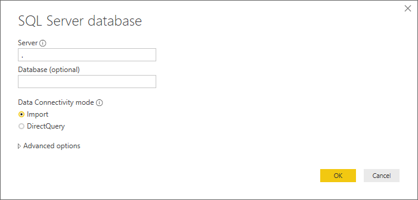
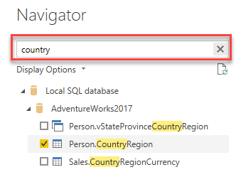

# SQL-bronnen inladen

De CSV-data uit de vorige opdracht was niet heel nuttig: er zat veel technische data in, en miste wat context. Het blijkt echter dat ook deze context niet in het Data Warehouse ontsloten is. En aangezien we wel graag snel enkele inzichten hierover willen, moeten we verder zoeken. We komen uit bij twee operationele bronsystemen, waar de data voor ons beschikbaar is.

## Voorbereiding

We gaan verder met het rapport dat we op een CSV-bestand hebben gebouwd.

## Inladen van SQL-data

Om de data nu nuttiger te maken, gaan we er data uit andere tabellen aan toevoegen. 

1. Maak hiervoor verbinding met de **SQL Database** die op Azure staat:
   * Adres: sigmadatalearning.database.windows.net
   * Database: AdventureWorks2019
1. Laat de Data Connectivity mode op "Import" staan:
   

In het volgende venster word je gevraagd hoe je verbinding met deze database wilt maken.

3. Kies voor een **Database** login en vul de volgende login-gegevens in:
   * User: PowerBIUser
   * Password: PowerBI2
   

Het venster "Navigator" opent. Je ziet nu eerst een lijst van _views_, daaronder de _tabellen_ en uiteindelijk _table-valued functions_. Merk op dat hier verschillende icoontjes voor zijn! 

4. Selecteer de volgende _tabellen_:
   * Person.CountryRegion
   * Sales.SalesTerritory
   * Production.Product
   * Production.ProductSubcategory
   * Production.ProductCategory

Je kunt hier de zoekfunctie voor gebruiken:

5. Klik op **Load** om de data in te laden.

Vervang nu in de rapportage de TerritoryID met de kolom "Name" uit SalesTerritory. Vervang ProductID door de kolom "Name" uit ProductCategory. Zet de weergave van de X-as weer aan voor deze grafiek.

> ### Automagie
>
> Power BI heeft hier enkele relaties voor je aangelegd, zodat de data die je zojuist hebt ingeladen gekoppeld kon worden aan de data die uit een CSV-bestand kwam. Dit doet Power BI op basis van de kolomnamen, en op basis van de inhoud daarvan (alle waarden uit kolom A in tabel 1 moeten exact één keer voorkomen in kolom A in tabel 2).
>
> Als je het interessant vindt, kun je kijken of je kunt achterhalen tussen welke kolommen de relatie gelegd is en welke "richting" deze heeft.

Laad nu de tabel "SalesLT.Store" vanuit de Azure SQL Database "AdventureworksLT"

* server: sigmadatalearning.database.windows.net
* database: AdventureWorksLT

Voeg nu in het rapport achtereenvolgens de volgende velden toe:

1. Store -> Name
2. 2014-01 -> Freight

Zoals je ziet wordt voor elke winkel exact hetzelfde bedrag aan vrachtkosten ("freight") weergegeven. Dit is uiteraard niet correct!
Het geeft aan dat tussen deze velden (`'Sales LT Store'[Name]` en `'2014-01'[Freight]`) geen relatie bestaat. In een volgende module kijken we hoe we deze relatie kunnen vormgeven.

## Volgende modules

De volgende module is Module 7: Data Modeling 101. Het eerste onderwerp hier is [Relaties](../07-data-modeling-101/08-relaties.md). Hieronder vind je een overzicht van alle modules:

1. [Introductie Power BI Desktop](../01-introduction/01-introduction-powerbi-desktop.md)
2. [Rapporteren op kubus-data en eerste visualisatie](../02-reporting-on-cube-data/02-reporting-on-cube-data.md)
3. [Visuals en interactie](../03-visuals-and-interaction/03-visuals-and-interaction.md)
4. [Publiceren en samenwerken in workspaces](../04-publishing-and-collaboration-in-workspaces/04-publishing-and-collaboration-in-workspaces.md)
5. [Drillthrough](../05-drillthrough/05-drillthrough.md)
6. Self-service reporting
   * [CSV-bestanden inladen](../06-self-service-reporting/06-csv-inladen.md)
   * [SQL data inladen](../06-self-service-reporting/07-sql-inladen.md) (huidige module)
7. Data Modeling 101
   * [Relaties](../07-data-modeling-101/08-relaties.md)
   * [Opschonen van je datamodel](../07-data-modeling-101/09-opschonen.md)
   * [Verrijken met Calculated Columns](../07-data-modeling-101/10-calc-columns.md)
8. [Introductie Power Query (GUI)](../08-power-query-gui/11-power-query.md)
