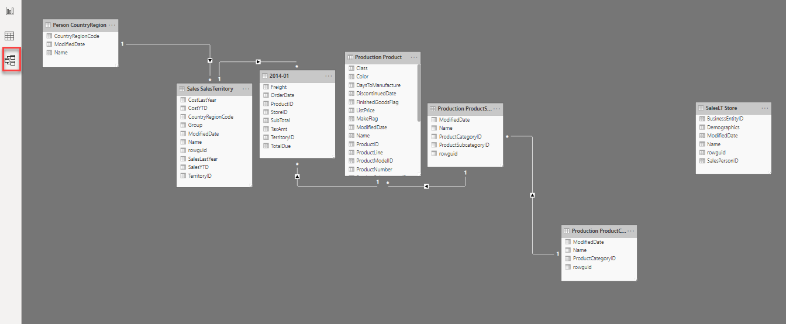
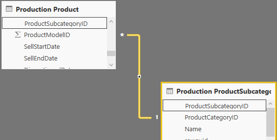
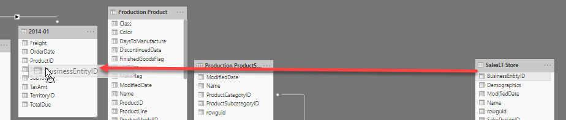

# Relaties leggen

In de vorige module zagen we dat er een relatie ontbrak tussen de tabel *Store* (waarin de winkels staan) en de tabel *2014-01* (waar de verkopen uit 2014 in aangeleverd zijn).

## Aanmaken van relaties

Om relaties aan te maken, schakel je naar de "Relationships" weergave.

Zoals je ziet, liggen er diverse relaties, weergegeven door lijntjes tussen de tabellen. Wanneer op een relatie klikt, zie je hoe de relatie loopt en welke kolommen naar elkaar refereren. In een relatie zijn drie belangrijke kenmerken:

1. de "1"-zijde
2. de "*"-zijde
3. de filter-richting

In bovenstaand plaatje:

* De relatie loopt tussen _Production ProductSubcategory_ en _Production Product_
* De relatie ligt aan beide zijden op de kolom _ProductSubcategoryID_
* De kolom _ProductSubcategoryID_ is uniek binnen de tabel _Production Product_ (dit is aangegeven door de "1" bij de relatie)
* Wanneer je de tabel _Production ProductSubcategory_ filtert (door bijvoorbeeld in een rapport te klikken op een subcategorie), dan werkt deze filter door in de lijst met weergegeven producten.

Probeer dit laatste uit in de Report-weergave van Power BI.

Er mist momenteel een relatie tussen de tabel "2014-01" en de tabel "Store". Leg deze aan, door de kolom "BusinessEntityID" te slepen van "Store" en los te laten boven de kolom "StoreID" in de tabel "2014-01":

Keer nu terug naar de "report" weergave en verifieer dat de weergave van vrachtkosten per winkel correct gaat.

## Volgende modules

Binnen deze module over Data Modeling is de volgende les [Opschonen van je datamodel](../07-data-modeling-101/09-opschonen.md). Hieronder vind je een overzicht van alle modules:

1. [Introductie Power BI Desktop](../01-introduction/01-introduction-powerbi-desktop.md)
2. [Rapporteren op kubus-data en eerste visualisatie](../02-reporting-on-cube-data/02-reporting-on-cube-data.md)
3. [Visuals en interactie](../03-visuals-and-interaction/03-visuals-and-interaction.md)
4. [Publiceren en samenwerken in workspaces](../04-publishing-and-collaboration-in-workspaces/04-publishing-and-collaboration-in-workspaces.md)
5. [Drillthrough](../05-drillthrough/05-drillthrough.md)
6. Self-service reporting
   * [CSV-bestanden inladen](../06-self-service-reporting/06-csv-inladen.md)
   * [SQL data inladen](../06-self-service-reporting/07-sql-inladen.md)
7. Data Modeling 101
   * [Relaties](../07-data-modeling-101/08-relaties.md) (huidige module)
   * [Opschonen van je datamodel](../07-data-modeling-101/09-opschonen.md)
   * [Verrijken met Calculated Columns](../07-data-modeling-101/10-calc-columns.md)
8. [Introductie Power Query (GUI)](../08-power-query-gui/11-power-query.md)
