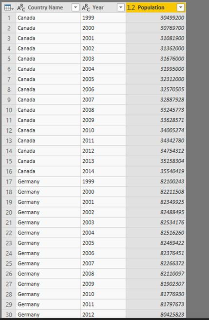
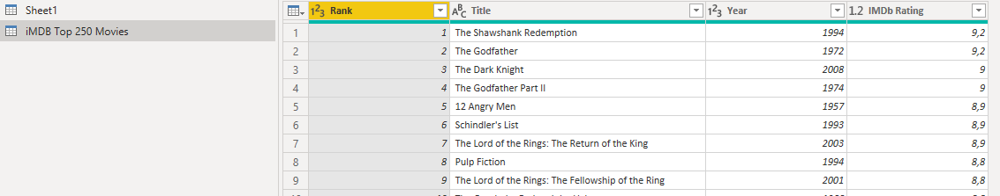

# 07 Power Query via de GUI

In [module 5](../05-self-service-reporting/05-csv-inladen.md) we already briefly looked at Power Query: how the window is structured, and how code is built behind the scenes.

However, in most Power BI models you will not need to use this code: most of the work is easily done in the GUI. In this module we load a "difficult" file via Power Query.

## Preparation

Start Power BI Desktop with a new, blank report.

## New delivery

We were asked by one of our analysts whether data about population figures can be added to the Power BI model. She has supplied the data in an [Excel file](excel-aanlevering/pop-by-year.xlsx), which looks more or less like this (for the exact format: open the [Excel file](excel-aanlevering/pop-by-year.xlsx)):

| Total population is based on (...) |  |  |  |
| --- | --- | --- | --- |
| Source | `http://data.worldbank.org/indicator/SP.POP.TOTL` |  |  |
| Terms of use | `http://data.worldbank.org/summary-terms-of-use` |  |  |
|  |  |  |  |
| Country Name | 1999 | 2000 | (...) |
| Canada | 30499200 | 30769700 | (...) |
| Germany | 82100243 | 82211508 | (...) |
| (...) | (...) | (...) | (...) |

This is a structure that is traditionally difficult to read into data processing tools:

* Various descriptive rows
* Head row does not start at the top, but only on row 5
* Years broken down into columns (instead of rows)

In an analysis tool like Power BI you would prefer to have it in the following structure:

| Country Name | Year | Population |
| --- | --: | --: |
| Canada | 1999 | 30499200 |
| Canada | 2000 | 30769700 |
| Germany | 1999 | 82100243 |
| Germany | 2000 | 82211508 |

However, this data is fairly easy to load in Power Query. Below is indicated which things you can use for this (obviously not in the correct order or with concrete steps). Look where you get!

* *Unpivot columns* (or *Unpivot other columns*)
* *Renaming Columns*
* *Use First Row as Headers*
* Removing existing steps (in the *applied steps* under the *query settings* are some suggested steps by default - there is a good chance that they are not immediately correct)
* *Remove Rows*

The outcome should look like this:

## Bonus: crazy data structures

So far we have loaded data from four types of sources:

* CSV
* SQL Server
* Azure SQL Database
* Excel files in an awkward format

For the bonus, we'll add one more source to this: the IMDB top 250 movies [http://www.imdb.com/chart/top](http://www.imdb.com/chart/top). We cannot directly link analysis about movies to our current model, but it is a great example about Power BI's possibilities to handle almost any data source.

Below is a screenshot of how the data should look like in Power Query. You can load the data with "Get Data" -> "From Web".

Tip: You will regularly need the "split column" functionality here

## Solution

Here's the endpoint of this lab: [07-Solution](07-Solution.pbix)

## Video

Here is the [Walkthrough video](https://vimeo.com/586426409/4643cf94cf)

## Next modules

The next module is [Module 8: Publishing and Collaboration in Workspaces](../08-publishing-and-collaboration-in-workspaces/10-publishing-and-collaboration-in-workspaces.md). Below is a complete overview of all available modules:

1. [Introduction Power BI Desktop](../01-introduction/01-introduction-powerbi-desktop.md)
2. [Reporting on a Dataset](../02-reporting-on-dataset/02-reporting-on-dataset.md)
3. [Visuals and interaction](../03-visuals-and-interaction/03-visuals-and-interaction.md)
4. [Drillthrough](../04-drillthrough/04-drillthrough.md)
5. Self-service reporting
   * [Loading CSV files](../05-self-service-reporting/05-csv-inladen.md)
   * [Loading data from SQL Databases](../05-self-service-reporting/06-sql-inladen.md)
6. Data Modeling 101
   * [Relations](../06-data-modeling-101/07-relaties.md)
   * [Cleaning up your Data Model](../06-data-modeling-101/08-opschonen.md)
7. [Introduction to Power Query (GUI)](../07-power-query-gui/09-power-query.md) (current module)
8. [Publishing and Collaboration in Workspaces](../08-publishing-and-collaboration-in-workspaces/10-publishing-and-collaboration-in-workspaces.md)
9. [Calculated Columns in DAX](../09-dax/11-calc-columns.md)
