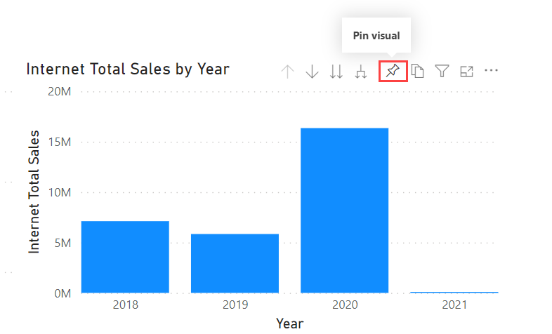
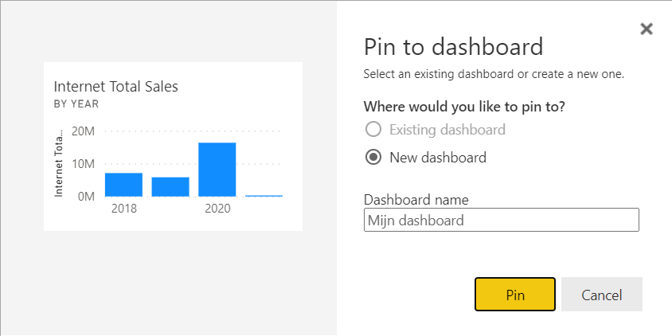
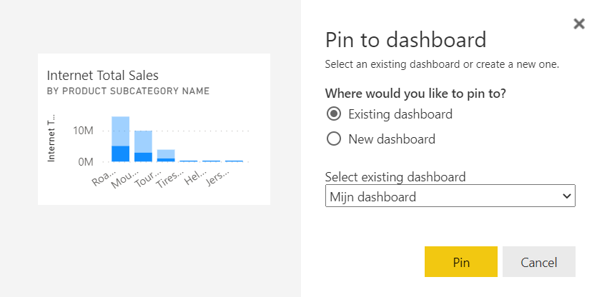
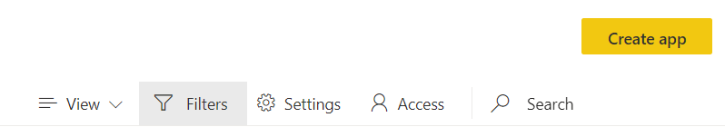
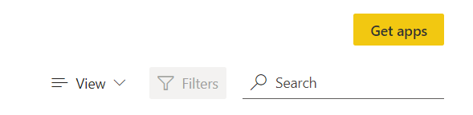

# 08 Publishing and Collaboration in Workspaces

## Publishing reports

When you *publish* a report, it will appear in the online Power BI portal. This can be found at [https://app.powerbi.com](https://app.powerbi.com).

* Open the Power BI template report [08-Start](08-Start.pbit)

You cannot directly access the dataset that originally belonged to the report. That's why you get the error message **Unable to connect**

* Click on **Edit**
* Select the **AdventureWorks** dataset from your own workspace, and click on **Create**

* Save your report in the folder where you keep the course files. Name it "Module 8"
* Under the **Home** ribbon, click on **Publish**
* In the **Publish to Power BI** window, select **My workspace**. This is your own private environment within the Power BI portal, and the place where we will initially post a report.

After the report has been uploaded, Power BI will provide you with a direct link to the report. Click the *Open 'Module 8.pbix' link in Power BI* to view the report.

As you can see, you can now view and use the report from a web browser.

## Dashboards

In the online environment of Power BI, in addition to reports, you also have *dashboards* at your disposal. These are collections of various *visuals* compiled by you from the reports you have published. Follow these steps to build a dashboard:

* With the **Module 8** report open on the **Page 2** tab, point your mouse at **Internet Total Sales by Year**
* Click on the icon of a pin that appears below or above the graph (depending on your browser and screen resolution):

Power BI then asks you for a dashboard where it can "pin" this visual. If you don't have any dashboards yet, you can only choose *New dashboard* here.

* Choose **New dashboard**, give it the name **My Dashboard**
* Click on **Pin**

* Now switch to the **Product Sales** tab. Select the region Australia on the map here.
* **Pin** now the graph **Internet Total Sales per Product Subcategory Name** to the newly created dashboard.

* Now open **My Workspace**
* Your content list will contain **My Dashboard**. Click on this.

As you can see, the visuals will appear the way you saw them in the report when you pinned them. The **Internet Total Sales per product subcategory name** therefore has a filtered view. However, the content is updated when the underlying data changes.

The dashboard consists of so-called "tiles". There are not only visuals, but also other tiles that you can add. For example via the "Add tile" button in the "Edit" menu:

* Now try to finish the dashboard so that it looks like this.
* The URL of the image used here is [http://www.slate.com/content/dam/slate/blogs/future_tense/2015/09/01/google_s_new_animated_logo_is_the_future_of_mobile_branding/google_logo.gif.CROP.original-original.gif](http://www.slate.com/content/dam/slate/blogs/future_tense/2015/09/01/google_s_new_animated_logo_is_the_future_of_mobile_branding/google_logo.gif.CROP.original-original.gif).

## Creating workspaces

To be able to collaborate on reports, you can create so-called "workspaces" or "workspaces" in the Power BI portal.

* Click on "Workspaces"
* Click "Create a workspace"

> If you are using the free version of Power BI, you will probably get an **Upgrade to Power BI Pro** window here. Choose here for **Try Pro for free** - you can then use the features of Power BI Pro for 60 days.

* Give the workspace a creative name

In the workspace, you can also add colleagues to share your work. This is somewhat similar to how Office 365 groups work. In the past, each Power BI group was also automatically an Office 365 group - however, since April 2019, this is a thing of the past and Power BI groups are managed separately within the Power BI portal.

## Upload and download within a workspace

Let's now upload and share Power BI reports. If you don't have colleagues who use Power BI or follow this Power BI training, you can also "play" colleagues yourself. To make the purpose (and origin) of these reports abundantly clear, we first rename them. Of course you don't have to do this in your daily work, but it is handy for training:

* Open Power BI Desktop
* Save the file 'Module 8' under a different name (eg something like "Power BI training Wortell Smart" and your own name in it).
* Publish the file to the workspace you just created

* Try to add some colleagues to your workspace, and see if you can watch a colleague's workspace.
  * You may need to restart Power BI before Power BI recognizes your (just created) Pro trial. You need this license to be allowed to publish to a *workspace*.
* Ask a colleague to download a report of yours, make some nice tweaks, and republish it to your workspace. See for yourself what is happening.

> What you just did is **collaborate** - this is for the "back end" of Power BI: the people you want to give permissions to edit your reports, add here. Together with them you are then responsible for *building* reports.

## Publishing an "App"

The collaboration capabilities in workspaces are aimed at report developers. However, it is not useful to share these directly with all end users:

* Workspaces are not very (end) user-friendly: you first have to go to a "workspace", to click on the correct report.
* Workspaces are also not very useful when you (as an end user) use reports from various teams: you would have to go through all the workspaces of those teams in search of the reports you need
* Sharing with an end user via a workspace limits your options as a report owner / developer: if you are developing a new page (of which the data may not yet be 100% correct), the end user will immediately see all changes.

To share reports with end users in a neat, simple and stable way, Microsoft has created the so-called "Power BI Apps". This means that as a report owner you can *publish* a report as if it were an "app", after which the report consumer *within the Power BI portal* can "retrieve" it again. Globally it looks like this:

1. You work with colleagues on a report in a workspace
2. You reach a "stable version" that you want to share with your end users
3. *You publish the workspace as an "app"*
4. You continue developing in the workspace: this will not affect the "published" app.
5. The end user "installs" the app and performs analyses
6. As soon as you want to publish a new(er) version of a report, republish the app. The end user will now automatically receive the latest version of the report.

* Now open the workspace you created earlier
* Right click on the Create App button at the top

* Enter a description of the app
* Switch to the **Navigation** tab
   * As you can see, there is currently only one report in this workspace. If there were more, you can add a simple navigation here.
* Switch to the **Permissions** tab
* Designate one or more colleagues within the course who may use your "app".
* Publish the app

### Using a published app

* Now switch to the **Apps** section in the menu on the left side of the Power BI Portal

This is the view for the users of Power BI apps. When you publish an app, you are automatically a user yourself, so that you can clearly see what the app would look like for your end users.

* Select the yellow button "Get apps"

* In the window, select the app you just added by clicking the blue text "Get it now".
* Your app has now been added to the Apps menu.
* Click on an app to automatically open the underlying report
* Also try to open some apps of colleagues

As mentioned above, the changes you make to the workspace are not visible to end users until you publish the app.

Test this:

* Make some changes to your report
* Republish it to your own workspace
* Check with yourself and/or with a colleague who uses the app whether the changes are indeed hidden
* Publish the app workspace
* Check if the changes are indeed coming through

## Solution

As this exercise was entirely within the Power BI Portal there is no solution file (we didn't author any report)

## Video

Here is the [Walkthrough video](https://vimeo.com/584747443/076f2c2845)

## Next module

The next (final) module is [Module 9: Calculated Columns in DAX](../09-dax/11-calc-columns.md). Below is a complete overview of all available modules:

1. [Introduction Power BI Desktop](../01-introduction/01-introduction-powerbi-desktop.md)
2. [Reporting on a Dataset](../02-reporting-on-dataset/02-reporting-on-dataset.md)
3. [Visuals and interaction](../03-visuals-and-interaction/03-visuals-and-interaction.md)
4. [Drillthrough](../04-drillthrough/04-drillthrough.md)
5. Self-service reporting
   * [Loading CSV files](../05-self-service-reporting/05-csv-inladen.md)
   * [Loading data from SQL Databases](../05-self-service-reporting/06-sql-inladen.md)
6. Data Modeling 101
   * [Relations](../06-data-modeling-101/07-relaties.md)
   * [Cleaning up your Data Model](../06-data-modeling-101/08-opschonen.md)
7. [Introduction to Power Query (GUI)](../07-power-query-gui/09-power-query.md)
8. [Publishing and Collaboration in Workspaces](../08-publishing-and-collaboration-in-workspaces/10-publishing-and-collaboration-in-workspaces.md) (current module)
9. [Calculated Columns in DAX](../09-dax/11-calc-columns.md)
