# Module 1 - Introductie Power BI

## Power BI Desktop downloaden en de eerste start

### Downloaden van Power BI

Power BI Desktop is gratis te downloaden en op elke Windows-machine installeren. Mocht dat op jouw computer nog niet gedaan zijn, dan kun je Power BI downloaden [vanaf de Microsoft Store](https://aka.ms/pbidesktopstore), of vanaf [www.powerbi.com](https://www.microsoft.com/nl-nl/download/details.aspx?id=58494). Wanneer het mogelijk is, installeer Power BI Desktop dan vanuit de Microsoft Store: dit zorgt ervoor dat je automatisch updates e.d. krijgt, en deze niet handmatig hoeft te downloaden.

Wanneer je Power BI wilt installeren vanuit de Windows Store, let dan goed op! Zoals je ziet zijn er namelijk drie edities:

* **Power BI** is een tooltje voor tablets waarmee je rapporten enkel kunt weergeven
* **Power BI Desktop** is de tool waarmee je rapporten kunt bewerken en vormgeven
* **Power BI Report Builder** is de tool waarmee je gepagineerde rapporten kunt maken

Kies in de Microsoft Store voor **Power BI Desktop**.

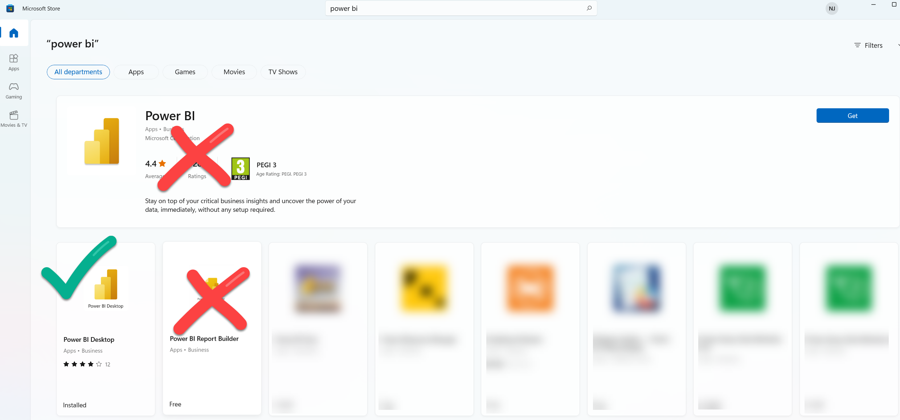

### De eerste start

De eerste keer dat je Power BI start zie je het volgende scherm:

Klik op "Get Started" om in te loggen en met Power BI te starten.

Waarschijnlijk heb je nog niet automatisch een Power BI account. Je kunt met de knop **Sign up for Power BI** dit eenvoudig regelen. Als je dit proces in de browser volledig doorlopen hebt, kun je direct met je eigen Power BI account inloggen bij Power BI Desktop.

Het scherm ziet er nu als volgt uit:

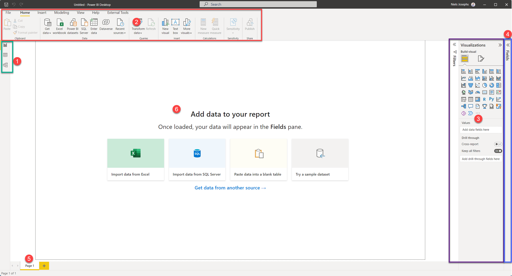

Merk de volgende zaken op:

1. Linksboven zie je drie knoppen, waarmee je tussen *drie weergaven* van je Power BI model kunt schakelen:
   * **Report**
   * **Data**
   * **Model**
2. Bovenin zie je een **ribbon** (of "lint"), die net werkt als in Office kent. De lint heeft zeven onderdelen:
   * **File** (menu): Vergelijkbaar met het gelijknamige menu uit Office: opslaan, exporteren, printen en instellingen
   * **Home**: Hier staan de meeste "basis" zaken die je nodig hebt voor het maken van Power BI-rapportages
   * **Insert**: Diverse zaken die je toe kunt voegen aan je rapportage
   * **Modeling**: Hier staan specifieke zaken voor het inrichten van je datamodel
   * **View**: Hier kun je visuele hulpmiddelen aan- en uitzetten, en schakelen tussen de mobiele weergave en de desktop-weergave
   * **Help**: Dit is een bijzonder ingewikkeld concept, dat voor nu te ver reikt om uit te leggen ;-)
   * **External Tools** wordt niet altijd weergegeven (hier op de screenshot wel), maar dit geeft de mogelijkheid om met andere software verder te bouwen aan Power BI-rapporten of -datamodellen
3. Aan de rechterzijde (paars omlijnd hierboven) zie je twee _panes_: **Visualizations** en **Filters**. Deze kun je in- en uitklappen door op de titel te klikken (try!). Er zijn drie grote onderdelen benoemd:
   * **Filters**: filters die van toepassing zijn op het huidige rapport, de huidige pagina, of de huidige visual
   * **Visualizations**: De verschillende visualisaties die je in een rapport kunt gebruiken.
   * **Fields** / **Format**: Hier zie je geen tekst van, maar dit zijn twee icoontjes waarmee je veel eigenschappen van visuals kunt instellen:  
   
   * **Drill trough**: Bijzondere drillthrough-filters (meer hierover later)
4. Uiterst rechts op het scherm (blauw omrand) is het **Fields** pane. Ook deze kun je in- en uitklappen. Hier zie je een lijst van alle tabellen, kolommen en measures die in je datamodel aanwezig zijn
5. Binnen de Report-weergave, zie je onderin de verschillende **pagina's** van een rapport
6. Binnen de Report-weergave is een groot wit vel aanwezig - de **canvas**. Hierop kun je je rapport vormgeven. De zwarte stippellijnen geven de randen aan.

# Module 2 - Rapporteren op de dataset: Power BI als rapportageschil

Power BI kan als volledige "self-service" tool gebruikt worden, maar ook inprikken op bestaande "datasets".

> ## Wat is een dataset
>
> Een dataset is een datamodel (verzameling aan tabellen en onderlinge verwijzingen) dat klaar staat voor analyse. Allerlei logica kan vooraf ingebouwd worden, zodat je door een paar klikken nieuwe vragen kunt stellen. Een paar termen die hier veel bij voorkomen:
>
> * **Measures** (ook wel metingen of meetwaarden) zijn de cijfers die je wilt analyseren.
>   * Vaak zijn dit eenvoudige, logisch optelbare waarden (zoals "aantal verkochte schroefjes")
>   * Een dataset maakt het echter ook mogelijk om meer geavanceerde measures vorm te geven, bijvoorbeeld:
>     * Percentage van budget
>     * Aantal schroefjes in magazijn
>     * Aantal verkochte schroefjes in het jaar, opgeteld tot aan de weergegeven datum
>   * Door een dataset goed te definiëren, kun je ervoor zorgen dat ook ingewikkelde measures correct te berekenen langs allerlei *dimensies*.
> * **Dimensies** zijn de "assen" waarlangs je de metingen uitsplitst
>   * In de vraagstelling hoor je vaak *per*:
>     * Aantal verkopen *per jaar*
>     * Aantal geweldsdelicten *per stadsdeel* *per maand*
>     * Hoeveelheid huisvuil *per straat*
>   * Deze *per* definities zijn meestal dimensies:
>     * Stadsdeel
>     * Periode (maand/jaar/datum)
>     * Productcategorie
>     * etc.
>
> Datasets maken het ook mogelijk om het ontsluiten en modelleren van data door andere personen te laten doen dan het maken van de rapporten zelf. Maar ook wanneer je alles helemaal zelf doet, maak je altijd onder water een dataset aan.

## Voorbereiding

Voordat we met deze dataset van start kunnen, moet je de dataset op jouw eigen Power BI-omgeving klaarzetten. Neem daarvoor de volgende stappen:

1. Open het bestand [AdventureWorks.pbix](AdventureWorks.pbix)
1. Klik op de knop **Publish**  
     
   Het venster **Publish to Power BI** opent zich nu, en vraagt je om een *workspace* te selecteren om je publicatie in te doen.
1. Kies hier voor **My workspace**, en klik op **Select**:  
     
   Als het goed is verschijnt er een groen vinkje en de tekst **Success!**
1. Sluit het venster door op de knop **Got it** te klikken
1. Sluit het Power BI venster

**Let op: het is belangrijk dat je geen Power BI-vensters meer open hebt staan na deze stappen!**

## Verbinding maken met de Power BI Dataset

Je hebt zojuist een Power BI dataset voor jezelf klaargezet. Dit was een stukje voorbereiding dat we nu zelf moesten doen, maar normaal gesproken kan dit ook door iemand anders gebeuren. Bijvoorbeeld door iemand uit een Business Intelligence- of Data Engineering-team, die data heeft klaargezet die breed gebruikt wordt op diverse plekken in de organisatie.

6. Open **Power BI Desktop**
6. Maak verbinding met een **Power BI Dataset**:
   * Klik op het pijltje onder "Get Data"
   * Kies **Power BI Datasets**
   * Kies het model **AdventureWorks**
   * Klik op **Connect**

> ## De casus
>
> In deze cursus kijken we naar een fictief bedrijf dat Microsoft vaak gebruikt als voorbeeld in haar cursussen: **AdventureWorks**.
>
> AdventureWorks verkoopt fietsen en fietsonderdelen - zowel direct aan klanten als via distributeurs. Ze hebben een kantoor in Nederland, en verkopen fietsen in de V.S., Duitsland en Spanje - zowel via de diverse distributeurs als direct via de website aan klanten.

## Eerste visualisatie

Doordat we ingeprikt hebben op een bestaande dataset, kunnen we gebruikmaken van kwalitatief hoogstaande data. Deze is al gecontroleerd op missende waarden, inconsistentie en andere zaken waar we vaak tegenaan lopen wanneer we zelf data inladen. Ook is in het datamodel aangegeven hoe de verschillende relaties tussen de tabellen liggen, en zijn er meestal *measures* aangemaakt waarin berekeningen "klaarstaan" die voor onszelf vaak lastiger zijn. We kunnen dus eenvoudig data uit meerdere tabellen combineren - de dataset zorgt voor de juiste interacties.

In deze eerste verkenning gaan we data van AdventureWorks bekijken. Specifiek kijken we naar de **Internet Total Sales** (het totaalbedrag aan verkopen via internet) en de **Internet Total Tax amt** (de hoeveelheid belasting die ze afdragen via internetverkopen). Om een gevoel te krijgen hoe de data eruit ziet, maken we hier enkele doorsnijdingen mee.

We gaan nu twee Power BI visualisaties maken:

* Internet Total Sales per Country Region Name
* Internet Total Tax amt per Total Children

### Internet Total Sales per Country Region Name

Deze is redelijk eenvoudig:

8. Zoek in het **Fields** pane via de zoekbox de *measure* **Internet Total Sales**. Klik deze aan.  
   
9. Zoek nu naar "Country", en vink **Country Region Name** aan.

Zoals je ziet, gaat deze grafiek eigenlijk automatisch goed. En hoewel de hoeveelheid tabellen en kolommen erg groot kan zijn, kun je eenvoudig zoeken in de lijst met velden.

### Internet Total Tax per Total Children

10. Probeer nu stappen 8 en 9 opnieuw uit te voeren, maar maak deze keer de grafiek te maken voor **Internet Total Tax Amt** (de hoeveelheid betaalde BTW voor internetverkopen) en **Total Children** (het aantal kinderen dat een klant heeft)

Omdat *Total Children* een numerieke waarde is, maakt Power BI hier automatisch een zogenaamde *measure* van: een meetwaarde die optelbaar is. Je ziet dus de som van alle kinderen van alle klanten nu weergegeven naast de betaalde belasting. Wanneer je het sigma-teken &Sigma; ziet staan voor een veld, is dit een indicatie dat Power BI het als *measure* kan gebruiken (hoewel de dataset het niet expliciet als *measure* heeft aangeboden!)

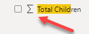

11. Zorg er nu voor dat de grafiek die je zojuist gemaakt hebt geselecteerd is.
12. Verplaats nu in de **Eigenschappen** van de grafiek (onder de **visualizations** pane) het veld **Total Children** van het kopje **Value** naar **Axis**.

Hiermee geven we aan dat "Total Children" niet een veld is dat we willen optellen, maar dat we op de as willen zetten, om erlangs uit te splitsen. Het resultaat is nu als volgt:

Stel dat we nu een extra uitsplitsing zouden willen doen naar het aantal kinderen dat nog thuis is (*Number of Children at Home*), dan zien we in de fields-lijst ook hier een sigma-teken voor staan. 

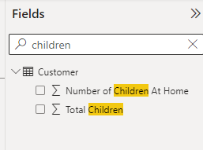
We kunnen er echter ook expliciet aangeven hoe Power BI dit veld toevoegt aan een grafiek:

13. Zorg er nu voor dat de grafiek die je zojuist gemaakt hebt geselecteerd is.
14. Sleep het veld **Number of Children at Home** vanuit de **Fields** lijst naar het kopje **Legend**
    
15. *Resize* de grafiek zodat deze netjes wordt weergegeven:

## Interactie tussen grafieken

Klik op één van de landen in de eerste grafiek. Zoals je ziet verandert de andere grafiek mee.

## Hands-on: rapportage maken

Aangezien Power BI nieuw is binnen Adventure Works, is je leidinggevende bijzonder benieuwd wat er allemaal mee mogelijk is. Hij heeft onder andere veel gehoord over de geografische weergaves die er standaard in aanwezig zijn, en heeft jou gevraagd eens één en ander mee uit te proberen.

Hieronder staan op een iets hoger niveau de stappen om een rapport te maken. Dit is bewust (zodat je ervaring met de tool vergroot wordt) - maar tegelijkertijd is het heel normaal dat je ergens niet uitkomt. Dan helpt het niet om lang te zitten tobben - vraag gerust om hulp!

16. Maak een nieuwe pagina, genaamd 'Product Sales'
16. Schakel naar deze nieuwe pagina
16. Maak een grafiek waarin je de **Internet Total Sales** uitzet tegenover *Product Subcategory Name** (*neem deze uit de dimensie Product Subcategory*!)
16. Selecteer deze grafiek.
16. Verander de **Filter on this visual** voor **Product Subcategory Name** in een **Top N** filter

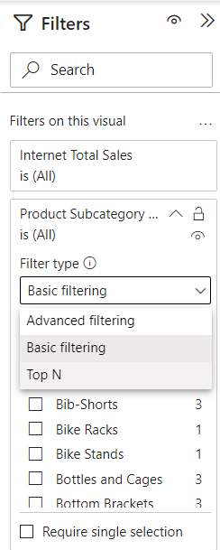

21. Filter deze op de top 6, sleep het veld "**Internet Total Sales** naar het kopje **by value**.
21. Klik **Apply filter**
21. Probeer nu zelf een **map visual** toe te voegen (dit is het "witte" wereldbolletje onder **Visualizations**). Zet hierin de **Country Region Name** uit tegen **Internet Total Sales**. Maak de grafiek vervolgens breed genoeg zodat alle landen waar verkocht wordt duidelijk zichtbaar zijn.
21. Voeg nu een tabel toe met de volgende daarin de volgende velden:
    * **Country Region Name**
    * **State Province Name**
    * **City**
    * **Internet Total Sales**
    * **Internet Total Margin**
21. Plaats de tabel en kaart direct onder elkaar, en maak ze exact even breed.
21. Voeg nu een titel toe aan de pagina, door een **Text box** te kiezen uit de **Home** ribbon. Maak deze tekst groter (bijv. 32), en vul de tekst **Product Sales** in. Plaats deze volledig linksbovenin het rapport
21. Voeg drie **Card** visuals toe, voor de volgende velden:
    * **Internet Total Sales**
    * **Internet Total Margin**
    * **Internet Total Units**

> Om te ontdekken wat een **Card** visual is, zul je de namen van de tooltips moeten verkennen. De naam van een visual wordt weergegeven als *tooltip* wanneer je de cursor er enige tijd op laat rusten:
>
> 

28. Zet de drie **Card** visuals strak naast elkaar direct onder de titel. Verklein de tekst indien nodig.
28. Maak de pagina af met een willekeurig bedrijfslogo rechtsbovenin (je kunt hier bijvoorbeeld het AdventureWorks-logo opzoeken, of je eigen bedrijfslogo)

Het eindresultaat kan er bijvoorbeeld als volgt uit zien:

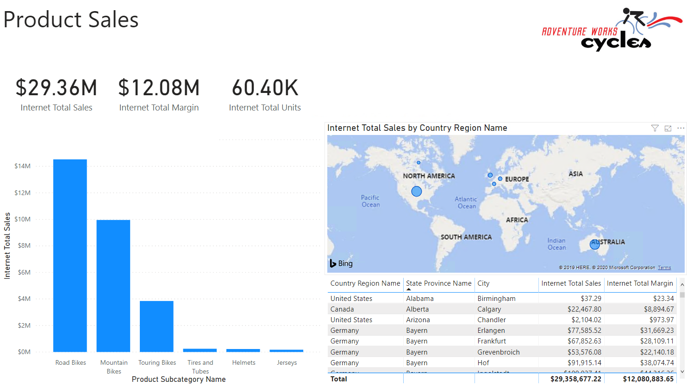

# Module 3 - Visuals en interactie

Binnen Power BI zitten veel mogelijkheden om de weergave en werking van je rapporten aan te passen. In deze module willen we hier iets verder naar kijken aan de hand van de volgende punten:

* Interacties tussen grafieken
* *Drilldown* en hiërarchie
* Voorgedefinieerde hiërarchie gebruiken
* Aanpassen van visuals
* *Custom visuals* van de *Power BI Marketplace*

## Voorbereiding

**Open** het bestand [03-Start.pbit](03-Start.pbit)

Tijdens het openen krijg je wellicht de volgende melding.

Klik dan op **edit** en kies vervolgens de **AdventureWorks** dataset in je eigen Workspace uit:

## Interactions

Zoals je in [de vorige module](../02-reporting-on-dataset/02-reporting-on-dataset.md) gezien hebt, is er binnen Power BI automatisch *interactie* tussen de grafieken. Wanneer je op één grafiek klikt, heeft dit effect op een andere grafiek:

* Selecteer nu de rechtergrafiek op **Page 1** (*Internet Total Tax Amt by Total Children and Number of Children At Home*).

Op het moment dat je een grafiek selecteert, verschijnen er bovenin het scherm twee nieuwe items op het lint: *Format* en *Data / Drill*

* Selecteer de tab **Format**, en klik op de knop **Edit Interactions**

Je ziet nu in je rapport rechtsboven elk object waar data in zit *behalve de huidig geselecteerde grafiek* één of meer van de volgende icoontjes verschijnen:

Dit bepaalt hoe de bewuste grafiek zal reageren wanneer je de door jou geselecteerde grafiek van selectie verandert:

* **Filteren** (optie 1) - alle data die niet binnen de selectie valt, wordt niet weergegeven
* **Markeren** (optie 2, standaardinstelling) - alles buiten de selectie wordt lichter gekleurd weergegeven
* **Niet filteren** (optie 3) - er verandert niets, ongeacht wat je aanklikt

Probeer de drie opties uit, en zie de effecten.

Verander nu het rapport op de pagina **Product Sales** zodanig dat:

* Bij selectie van een Product Subcategory in de linkergrafiek (bijv. "Road Bikes") wordt de inhoud van de drie *card visuals* (*Internet Total Sales*, *Internet Total Margin* en *Internet Total Units*) niet gefilterd. Deze cijfers veranderen dus niets, ongeacht je selectie.
* Wanneer je rechtsonder in de tabel iets selecteert (bijv. "Germany"), wordt de linkergrafiek (*Internet Total Sales by Product Subcategory Name*) gefilterd. Hier zijn dus dan alleen de verkopen van die betreffende tabelrij zichtbaar.

Controleer de resultaten door "Road Bikes" te selecteren. Het resultaat zal als volgt zijn:

## Hiërarchie en drilldown

### Hiërarchie

Veel van de data die we analyseren heeft een hiërarchie in zich:

* Eerste analyses gebeuren op jaar- of kwartaalcijfers, daarna dalen we af richting maanden of dagen
* We starten met een analyse van de performance van accountmanagers, kijken daarna specifieker naar de onderliggende klanten
* We analyseren onze productverkopen per categorie, zien dat de meeste verkopen in fietsen zitten, dus splitsen we die uit in de subcategorieën.

In de datamodellen die we vanuit een dataset of Power BI-model afnemen, wordt data vaak al in een hiërarchie aangeboden. Bijvoorbeeld de Category-hiërarchie in de tabel *Product*:

* Maak een nieuw tabblad
* Selecteer de *measure* **Internet Total Sales**
* Selecteer de *hiërarchie* **Category** in de tabel **Product**
* Bekijk de grafiek-eigenschappen. 
  * Onder "X-axis" staat *Category*
  * Je ziet hier diverse niveaus (Category, Subcategory, Model, Product), toch is in de grafiek momenteel enkel het hoogste niveau zichtbaar.
* Maak de grafiek wat breder, zodat je de volledige titel kunt zien. De titel is momenteel "Internet Total Sales by Category": het zichtbare niveau dus.

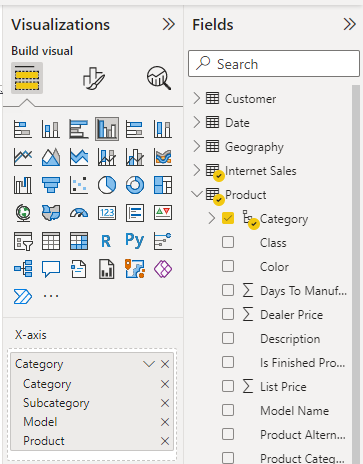

### Drilldown: eerste verkenning

Rechtsboven in de grafiek bevindt zich een verzameling met pijltjes. Deze zijn bedoeld om door de hiërarchie heen te navigeren.

* Klik op het pijltje naar beneden ().
  * Dit pijltje staat voor *drilldown* (de BI-term voor het "inzoomen" naar een lager niveau)
* Klik nu op de categorie "Bikes". Je ziet dat:
  1. De titel van de grafiek verandert naar *Internet Total Sales by Category and Subcategory*
  2. De subcategorieën op het Subcategory-niveau worden weergegeven *die zich binnen Bikes bevinden*
* Wanneer je weer wilt uitzoomen (*drill up*), klik je op het pijltje naar boven.

### Meer hiërarchie en drilldown

Een andere hiërarchie die in deze dataset aanwezig is, is de *Calendar* hiërarchie (binnen de tabel **Date**). 

* Maak een grafiek waarin de **Internet Total Sales** wordt uitgesplitst over **Calendar**.
* *Drilldown* naar het jaar 2020.
  * De grafiek **Internet Total Sales by Category** filtert nu mee.

Wanneer we nu een *drill down* doen op een jaar, komen we eerst bij een semester, en daarna bij een kwartaal. Dat is wel een beetje veel van het goede. Daarom gaan we deze velden (voor deze specifieke grafiek) uit de hiërarchie halen.

* In de eigenschappen van de grafiek, onder *Axis*, verwijder de niveaus **Semester** en **Quarter**

De hiërarchie is nu *in deze grafiek* Jaar-Maand-Dag geworden. Verifieer dit.

### Handmatige hiërarchie

* Selecteer nu opnieuw de linkergrafiek *Internet Total Sales by Category*
* Sleep vanuit het **Fields** *pane* het veld **Country Region Name** uit de tabel **Geography** naar het **Axis** veld. Plaats het veld *boven* de *Category* hiërarchie.

De grafiektitel is nu *Internet Total Sales by Country Region Name*, en we kunnen via een *drilldown* verder afdalen door de *Category* hiërarchie, op basis van het land dat we bekijken.

### Go to the next level

Naast een *drilldown* kun je ook een niveau afdalen in de hiërarchie zonder dat je je specifiek beperkt tot één categorie. Dit kan met de rechter twee knoppen:

Ga in de linkergrafiek naar het hoogste niveau (dus *Country Region Name*), en probeer de laatste twee knoppen uit. Wat is het verschil?

### Filteren van andere visuals

Zoals je wellicht opgevallen is, zorgt een *drilldown* er ook voor dat andere grafieken gefilterd worden: wanneer je in de linkergrafiek een land selecteert, verandert de grafiek *Internet Total Sales by Year* ook mee:

Standaard werkt de filtering van een *drilldown* gelijk aan de filtering van een *selectie* (die je bijvoorbeeld via **Edit interactions** ingesteld hebt) binnen de grafiek. Je kunt de drilldown-filtering echter ook uitschakelen.

* Selecteer de linkergrafiek (*Internet Total Sales by Country Region Name*)
* Open het menu *Format*
* Naast de knop *Edit interactions* staat een pulldown menu, wijzig daar *Entire Page* in *Selected visual*.

Nu zorgt een *drilldown* niet meer automatisch voor een filtering binnen een andere grafiek. Selecties werken nog wel.

# Module 4 - Drillthrough
## Voorbereiding

Ga verder met het bestand dat je in de vorige module hebt gemaakt.

Alternatief als je de vorige opdracht niet correct hebt afgerond:

**Open** het bestand [04-Start.pbit](04-Start.pbit)

Tijdens het openen krijg je wellicht de volgende melding. 

Klik dan op **edit** en kies vervolgens de **AdventureWorks** dataset in je eigen Workspace uit:

## Opdracht

Binnen **Adventure Works** is je leidinggevende bijzonder te spreken over de geografische mogelijkheden van Power BI. Het is echter niet heel handig om alle geografische achtergrondinformatie over een regio in elk rapport te herhalen. Het liefst zou ze bij bijvoorbeeld een uitschieter in verkopen in een bepaald land willen kunnen "doorklikken" naar alle informatie van dat land. Bijvoorbeeld de trend in verkopen de afgelopen jaren, het aantal vestigingen in dat land, etc..

Dit "doorklikken" wordt in een BI tool **drillthrough** genoemd. In [module 3](../03-visuals-and-interaction/03-visuals-and-interaction.md) hebben we al gekeken naar de *drilldown*. De *drillthrough* houdt in de basis in dat je een getal onder de loep neemt op een andere pagina of in een ander rapport. Op deze manier kun je eenvoudig de context bekijken - bijvoorbeeld van de verkopen binnen een bepaald land.

## Drillthrough binnen een rapport

Wanneer je een drillthrough binnen een rapport mogelijk wilt maken, moet je de volgende zaken regelen:

1. Er moet een pagina zijn wat het *doel* van je drillthrough is.
   * In het voorbeeld hierboven: de pagina "Country Details"
2. Op deze *doel*pagina moet je een "drillthrough filter" instellen. In het voorbeeld hierboven is dit de naam van het land: wanneer je die ergens in het rapport tegenkomt, kun je in twee klikken naar de drillthrough-pagina navigeren, wat dan automatisch gefilterd is op de betreffende categorie.
   * In het voorbeeld hierboven is het *drillthrough* filter `Country Region Name`.

### Drillthrough instellen in je rapport

* Open het rapport 'startpunt-module-4.pbit'
  * Selecteer zo nodig opnieuw je eigen *AdventureWorks* dataset (dit heb je in module 3 ook gedaan)
* Voeg een pagina toe met de naam "Country Details"
* Voeg hierop een *map visual* toe (). Configureer deze als volgt:
  * **Location**: **State Province Name** (tabel *Geography*)
  * **Size**: **Internet Total Sales** (tabel *Internet Sales*)
* Voeg nu ook een zgn. "Treemap" toe voor *Internet Total Sales by Product Category Name*:
  * Gebruik hier het veld **Product Category Name** uit de tabel **Product Category**

* Klik ergens op het canvas zodat er geen *visual* meer geselecteerd is.
* Onder het kopje **Drillthrough** vind je nu een vakje "Add drillthrough filters here". Sleep hier het veld **Country Region Name** heen (tabel *Geography*)
* Ga terug naar de pagina *Page 2*, en rechtsklik op één van de landen in de grafiek. Als het goed is heb je nu een submenu *Drillthrough* naar de *Country Details*-pagina

Om het af te maken, kun je nu de **Country Details** pagina verbergen (rechtsklik op de tab, kies **Hide Page**). Publiceer de pagina naar een workspace, publiceer deze als app, en bekijk het resultaten in de app.

Probeer nu zelf een tweede drillthrough-pagina "Product Category Details" aan te maken waarbij je alle gegevens binnen een productcategorie op een rij zet. Filter op basis van het veld **Product Subcategory Name** (tabel *Product Subcategory*). Geef de volgende zaken weer:

*Bij elk punt staat wat extra uitdaging - deze hoef je niet uit te voeren. Mocht alles je echter gemakkelijk afgaan en je wilt wat meer de grenzen van Power BI opzoeken, dan kun je je hier even in vastbijten*

1. Verkopen per man / vrouw / getrouwd / ongetrouwd
   * Extra uitdaging: voeg bijbehorende titels toe binnen de visual ("Married men", "Single men", etc.)
2. Verkopen per productkleur
   * Eerste extra uitdaging: geef alleen de 5 bestverkopende kleuren weer
   * Tweede extra uitdaging: laat de kleur bepaald worden door de productkleur
3. Internet Total Sales per jaar
4. Internet Total Units per jaar

Wanneer je drillthrough pagina correct werkt, zou je vanaf pagina "Product Sales" nu een drillthrough moeten kunnen maken naar "Product Category Details"

## Drillthrough tussen meerdere rapporten

*Drillthrough* is ook mogelijk tussen meerdere rapporten: je kunt dan de data vanuit een andere invalshoek meer verdieping geven in een ander rapport.

Om Drillthrough tussen meerdere rapporten werkend te krijgen hebben we (minstens) twee rapporten nodig:

* Het *bron-rapport*. Dit is het rapport waar je vandaan komt (hier "doe" je een drillthrough)
* Het *doel-rapport*. Dit is het rapport waar je terecht komt na een drillthrough.

Maak nu eerst via *File*, *New* een nieuw rapport dat verbinding maakt met de dataset AdventureWorks in je eigen workspace en sla dit op onder de naam *module-4-drillthrough-report*.

Maak in dit nieuwe rapport een drillthrough filter per **Year** (tabel *Date*, in de hierarchy *Calendar*). Let erop dat je hier instelt dat je **Year** gebruiken moet als *categorie*:

Je kunt vervolgens in het lijstje onder deze instelling een jaar kiezen dat je *nu* wilt weergeven (feitelijk filter je de data op "alleen de data van jaar X"). Zodra je via een *drillthrough* op dit rapport belandt, wordt dit filter vervangen door het jaartal waarmee je de drillthrough uitvoert. Het toevoegen van dit filter geeft je echter een beter gevoel over hoe de cijfers eruit zou zien bij een drillthrough van (bijvoorbeeld) 2012.

Vul vervolgens het rapport met inzichten over een jaar:

1. Het verloop van verkopen door het jaar heen (let op dat deze correct gesorteerd is)
2. De verhouding tussen de verkopen t.o.v. een kwartaal geleden

Stel vervolgens de drillthrough reporting in:

* In het **bron-rapport** (waar de drillthrough vandaan komt)
  * **File** -> **Options and settings** -> **Options**
  * Onder **Current file**, open **Report settings**
  * Zet het vinkje bij **Allow visuals in this report to use drillthrough targets from other reports**  
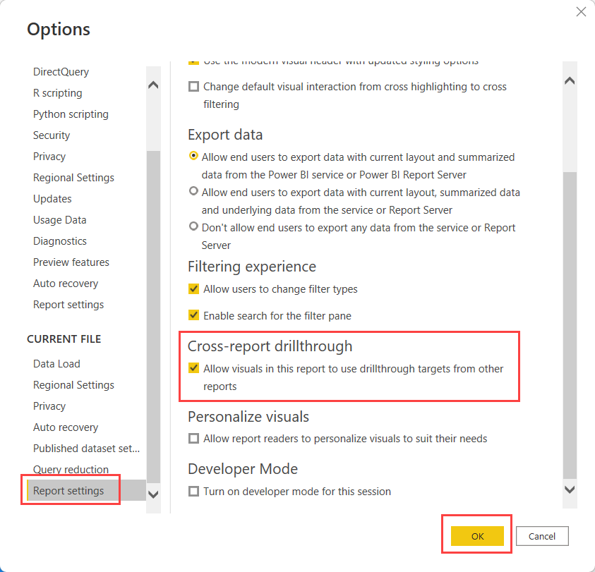
* In het **doel-rapport** (waar de drillthrough naartoe gaat):
  * Zet het vinkje **Cross-report** bij je **Drillthrough filter**  
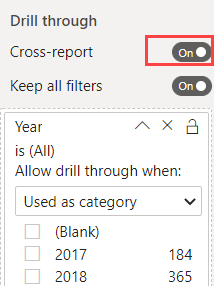

Publiceer het rapport, en test of de drillthrough over rapporten heen werkt in de Power BI Portal.

## Bonus-opgaven

### Aanpassen drillthrough-naam

Standaard heeft de drillthrough de naam `Page1 [naam-van-oorspong-rapport]`. Zorg ervoor dat hier een zinnige naam komt te staan, die de lading dekt.

# Module 5 deel 1 - CSV-data inladen, introductie Power Query en eerste visualisatie

Binnen het AdventureWorks Data Warehouse is veel data aanwezig, maar niet alle data. Het blijkt dat voor specifieke historische verkoopcijfers uit 2014 er nog extra data uit een oud systeem zijn, die niet in het Data Warehouse aanwezig zijn. Nu heeft de beheer-afdeling CSV-exports hiervan gemaakt, in de hoop dat jij deze inzichtelijk kunt maken in een rapport.

In deze module laden we CSV-data in. In een CSV-bestand is weinig kennis over bijvoorbeeld datatypes. Maar ook de manier waarop gegevens in een CSV-bestand opgeslagen staat kan verschillen. Daarom kun je hier soms tegen uitdagingen aanlopen. We kijken daarom alvast een klein beetje naar Power Query om deze uitdagingen het hoofd te bieden. Ten slotte maken we een eerste visualisatie op deze nieuwe data.

## Voorbereiding

Start Power BI Desktop met een nieuw, leeg rapport.

## CSV-Data inladen

1. Om een CSV-bestand in te laden ga je naar **Get Data** -> **Text/CSV**
  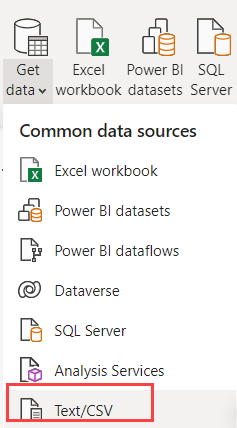
2. Selecteer het bestand ["2014-01.csv"](csv/2014-01.csv) uit de map "csv".

Power BI maakt nu een inschatting van de structuur van het CSV-bestand. CSV is echter niet het meest duidelijke datatype.
Wanneer we bijvoorbeeld in het CSV-bestand kijken, zien we daar op regel 1 het getal 26324.3267

Wat betekent 26324.3267?

* Is het 263 miljoen (263.243.267)?
* Is het 26 duizend (26.324,3267)?

Power BI maakt een aanname op basis van de landinstellingen van Windows: in een Nederlandse Windows-installatie zal hij de aanname maken dat een punt een duizendtalscheiding is, en een komma de scheiding decimale waarden. Maar dit CSV-bestand is afkomstig uit een Engelstalig softwarepakket, dus die vlieger gaat niet op:

3. Klik daarom onderin het venster op **Transform Data** om dit aan te passen.

Het Power Query venster opent zich nu.

Aan de rechterzijde zie je onder **Applied steps** de stappen die Power BI heeft genomen om je CSV-bestand te verwerken.

4. Klik onder de **applied steps** op de verschillende stappen, van boven naar beneden.
   * Bekijk wat voor wijzigingen er zijn gebeurd bij het inladen van de CSV.
   * Waar gaat het mis?
5. Verwijder de **Changed Type** stap door op het kruisje ernaast te klikken.

Met het verwijderen van de **Changed Type** stap hebben we de informatie over *datatypes* weggegooid. Power BI weet nu niet meer wat een getal of een datum is, en classificeert alles als tekst. Dit kun je ook zien aan het **ABC** icoontje boven je kolommen:

6. Selecteer nu de eerste vier kolommen: **TotalDue**, **SubTotal**, **TaxAmt** en **Freight**
   * Je kunt meerdere kolommen selecteren door de **Ctrl**-toets ingedrukt te houden op je toetsenbord

Zoals je eerder zag, interpreteerde Power BI de getallen (incorrect) door de instellingen voor land en regio vanuit Windows te gebruiken. In het Engels worden deze instellingen *Locale* genoemd. We gaan daarom Power BI opnieuw vertellen hoe deze data geïnterpreteerd moet worden, maar nu met de juiste regio-instellingen / *Locale*.

7. Rechtsklik op één van de kolommen en kies **Change Type** -> **Using Locale...**

8. Kies nu:
   * **Data Type**: **Decimal Number**
   * **Locale**: **English (United States)**

Onder *Sample input values:* geeft Power BI hoe de data nu verwacht wordt:

9. Selecteer nu alle andere kolommen:
   * ProductID
   * StoreID
   * TerritoryID
   * OrderDate
9. Op het lint kies je nu onder **Transform** de optie **Detect Data Type**

Power BI herkent nu op basis van de inhoud van de andere kolommen wat voor data erin zit.

11. Kies op het lint onder **Home** nu **Close & Apply** om de CSV-data in te laden.

## Data verkennen

Aan de rechterzijde zie je nu een tabel "2014-01" staan, met daaronder enkele velden. Momenteel zit er nog niet heel veel nuttige informatie in het datamodel: er is data van één periode uit 2014 aanwezig, maar alle verwijzingen naar winkels, producten en verkoopgebieden zijn enkel nog technische sleutels (de kolommen die een database onder water gebruikt om rijen uniek te kunnen identificeren - in dit geval bijv. `TerritoryID` en `ProductID`).

Maak nu drie Power BI visualisaties. Zorg ervoor dat de "per" velden (*per* TerritoryID bijvoorbeeld) hieronder niet worden gesommeerd, maar netjes uitsplitsen! Gebruik de standaard staafdiagrammen, en voer de bijbehorende wijzigingen door

1. **TotalDue** per **TerritoryID**
   * Maak de titel van de grafiek:
     * gecentreerd
     * rood
     * lettertype comic sans, 24pt (*en laat dit de laatste keer zijn dat je comic sans gebruikt in een datavisualisatie*)
   * Voeg voor **TerritoryID** een **Top 6 filter** toe, op basis van **TotalDue**
   * Verander de X-as van **Continuous** naar **Categorical**
   * Voeg een titel toe aan de X-as
2. **TaxAmt** per **ProductID**
   * Maak de X-as **Categorical**, en zet deze vervolgens uit
   * Stel als **Data colors** een **Conditional formatting** in (hint: klik op de puntjes naar *Default color*)
     * Stel de minimum-kleur in op de lichtste grijstint binnen de thema-kleuren
     * Stel de maximum-kleur in op de donkerste grijstint (niet zwart) binnen de thema-kleuren
     * Laat de overige instellingen standaard staan
     * Klik "OK"
3. Voeg een **slicer** toe voor het veld **Day**

> Wanneer je het bestand ["2014-01.csv"](csv/2014-01.csv) in een teksteditor bekijkt (bijvoorbeeld in *Kladblok* / *Notepad*), dan zul je zien dat het veld *Day* hier niet voorkomt. Power BI heeft hier gezien dat we een datum-veld in de brondata hadden zitten, en hier voor ons alvast een hiërarchie (Year, Quarter, Month, Day) op aangebracht.
>
> Handig, want veel van onze analyses zetten we uit over de tijd heen, en zelden hebben we daarbij het datum-niveau direct nodig!

Hieronder zie je een mogelijke uitkomst.

**Sla het bestand op - we gaan hier in het volgende onderdeel mee verder**.

# Module 5 deel 2 - SQL-bronnen inladen

De CSV-data uit de vorige opdracht was niet heel nuttig: er zat veel technische data in, en miste wat context. Het blijkt echter dat ook deze context niet in het Data Warehouse ontsloten is. En aangezien we wel graag snel enkele inzichten hierover willen, moeten we verder zoeken. We komen uit bij twee operationele bronsystemen, waar de data voor ons beschikbaar is.

## Voorbereiding

We gaan verder met het rapport dat we op een CSV-bestand hebben gebouwd.

Alternatief als je de vorige opdracht niet correct hebt afgerond:

**Open** het bestand [05-01-Solution](../05-self-service-reporting/05-01-Solution.pbix)

## Inladen van SQL-data

Om de data nu nuttiger te maken, gaan we er data uit andere tabellen aan toevoegen. 

1. Maak hiervoor verbinding met de **SQL Database** die op Azure staat:
   * Adres: wortellsmartlearning.database.windows.net
   * Database: AdventureWorks2019
1. Laat de Data Connectivity mode op "Import" staan:
   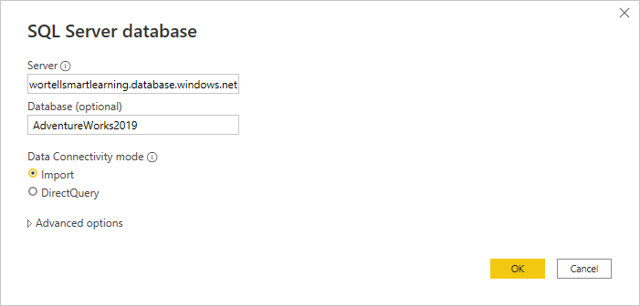
 
In het volgende venster word je gevraagd hoe je verbinding met deze database wilt maken.

3. Kies voor een **Database** login en vul de volgende login-gegevens in:
   * User: PowerBIUser
   * Password: PowerBI2  
   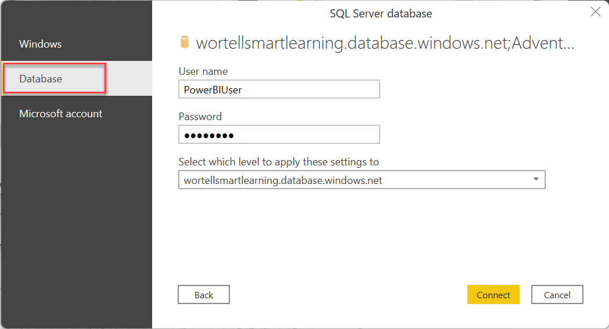

Het venster "Navigator" opent. Je ziet nu eerst een lijst van _views_, daaronder de _tabellen_ en uiteindelijk _table-valued functions_. Merk op dat hier verschillende icoontjes voor zijn! 

4. Selecteer de volgende _tabellen_:
   * Person.CountryRegion
   * Sales.SalesTerritory
   * Production.Product
   * Production.ProductSubcategory
   * Production.ProductCategory

Je kunt hier de zoekfunctie voor gebruiken:

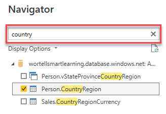

5. Klik op **Load** om de data in te laden.

Vervang nu in de rapportage de TerritoryID met de kolom "Name" uit SalesTerritory. Vervang ProductID door de kolom "Name" uit ProductCategory. Zet de weergave van de X-as weer aan voor deze grafiek.

> **Let op!** Zoals je ziet wordt voor elke regio en productcategorie exact hetzelfde bedrag weergegeven. Wanneer dit het geval is, is er meestal iets mis in je datamodel.
>
> In de volgende module zullen we hier oplossingen voor vinden.

In een ander bronsysteem hebben we ook wat informatie over winkels verzameld. Deze data gaan we nu inladen.

* server: wortellsmartlearning.database.windows.net
* database: AdventureWorksLT
* tabel: SalesLT.Store

Probeer nu de vrachtkosten per winkel weer te geven. Dit doe je door in het rapport een Tabel visualisatie toe te voegen met daarin de volgende twee velden:

1. SalesLT Store -> Name
2. 2014-01 -> Freight

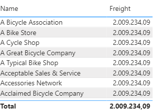

Zoals je ziet wordt ook hier voor elke winkel exact hetzelfde bedrag aan vrachtkosten ("freight") weergegeven, **maar ook dat het totaal exact hetzelfde is**. Dit geeft opnieuw aan dat tussen deze velden (`'Sales LT Store'[Name]` en `'2014-01'[Freight]`) geen relatie bestaat. In een volgende module kijken we hoe we deze relatie kunnen vormgeven.

# Module 6 deel 1 - Relaties leggen

In de vorige module zagen we dat er een relatie ontbrak tussen de tabel *Store* (waarin de winkels staan) en de tabel *2014-01* (waar de verkopen uit 2014 in aangeleverd zijn).

## Voorbereiding

We gaan verder met het rapport dat we op een CSV-bestand en SQL bron hebben gebouwd in de vorige module.

Alternatief als je het vorig onderdeel niet correct hebt afgerond:

**Open** het bestand [05-02-Solution](../05-self-service-reporting/05-02-Solution.pbix)

## Aanmaken van relaties

Om relaties aan te maken, schakel je naar de "Model" weergave.

Zoals je ziet, liggen er diverse relaties, weergegeven door lijntjes tussen de tabellen. Wanneer op een relatie klikt, zie je hoe de relatie loopt en welke kolommen naar elkaar refereren. In een relatie zijn drie belangrijke kenmerken:

1. de "1"-zijde
2. de "*"-zijde
3. de filter-richting

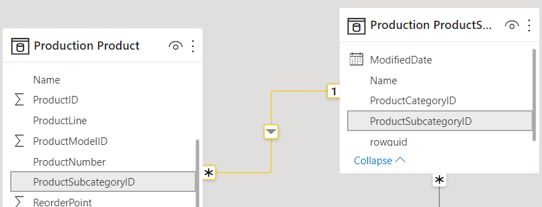

In bovenstaand plaatje:

* De relatie loopt tussen _Production ProductSubcategory_ en _Production Product_
* De relatie ligt aan beide zijden op de kolom _ProductSubcategoryID_
* De kolom _ProductSubcategoryID_ is uniek binnen de tabel _Production Product_ (dit is aangegeven door de "1" bij de relatie)
* Wanneer je de tabel _Production ProductSubcategory_ filtert (door bijvoorbeeld in een rapport te klikken op een subcategorie), dan werkt deze filter door in de lijst met weergegeven producten.

Probeer dit laatste uit in de Report-weergave van Power BI.

Er mist momenteel een relatie tussen de tabel "2014-01" en de tabel "Store". Leg deze aan, door de kolom "BusinessEntityID" te slepen van "Store" en los te laten boven de kolom "StoreID" in de tabel "2014-01":

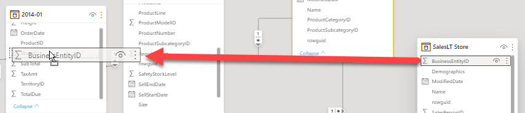

Keer nu terug naar de "report" weergave en verifieer dat de weergave van vrachtkosten per winkel correct gaat.

Maak vervolgens ook relaties aan voor:

* Sales Territory (TerritoryID) naar 2014-01 (TerritoryID)
* Production Product (ProductID) naar 2014-01 (ProductID)  

# Module 6 deel 2 - Opschonen en introductie calculated columns

Met alle relaties op de plaats kunnen we allerhande analyses uitvoeren op dit datamodel. Voordat we echter verder gaan maken we een korte pas op de plaats: kunnen we dit model wellicht wat gebruiksvriendelijker inrichten?

## Voorbereiding

We gaan verder met het rapport uit het vorig onderdeel van deze module.

Alternatief als je de vorige opdracht niet correct hebt afgerond:

**Open** het bestand [06-01-Solution](06-01-Solution.pbix)

## Opschonen van je model en calculated columns

Om het huidige model - dat direct uit een 3NF-bronsysteem afkomstig is - beter leesbaar te maken, kunnen we enkele zaken eenvoudig oppakken:

* Begrijpelijke namen toewijzen aan tabellen en kolommen
* Overbodige velden verwijderen
* Technische velden (zoals sleutels) verbergen
* Aantal niveaus in tabellen terugdringen

## Basis opschonen model

Om het model leesbaarder te houden, kunnen we overbodige kolommen verwijderen of verbergen.

* Bij verwijderen van een kolom wordt deze uit het datamodel verwijderd.
  * De kolom neemt dan geen ruimte meer in.
  * Dit doen we bijvoorbeeld voor niet-gebruikte kolommen die geen relevante betekenis voor ons hebben, of kolommen die bijzonder veel ruimte innemen zoals:
    * XML-data
    * Globally Unique IDentifiers (GUID-velden)
    * Afbeeldingen
* Bij verbergen van een kolom is deze standaard onzichtbaar voor een gebruiker.
  * Dit maakt het model meer toegankelijk, maar houdt de kolommen wel beschikbaar.
  * Dit is bijvoorbeeld handig voor ID-kolommen: die hebben geen betekenis, maar zijn wel belangrijk om bijvoorbeeld een relatie te leggen.

Voer de volgende zaken uit om het model leesbaarder te maken:

* Hernoem de tabellen
  * Person CountryRegion -> Country-Region
  * Sales SalesTerritory -> Sales Territory
  * Production Product -> Product
  * Production ProductSubcategory -> Product Subcategory
  * Production ProductCategory -> Product Category
  * "2014-01" -> Sales
* Hernoem de kolommen "Name" in elke tabel, zodat duidelijk is welke naam iets is
  * Bijv. in de tabel "Store" de kolom "Name" -> "Store Name"
* Hernoem de kolom "Group" in de tabel "Sales Territory" naar "Sales Territory Group"
* Verberg alle ID-kolommen
* Verwijder kolommen met XML- en GUID-data, en kolommen met de naam "ModifiedDate"

## Calculated Columns

In de "Data"-weergave van Power BI kun je eenvoudig bekijken welke data er momenteel in het datamodel zit.

We kunnen hier kolommen toevoegen die gevuld worden op basis van een DAX-expressie. Dit noemen we "Calculated columns".

* Voeg een nieuwe kolom toe aan de tabel "ProductSubcategory"

  * Typ de onderstaande expressie handmatig in:
  * Expressie: `Product Category = RELATED('Product Category'[Product Category Name])`

* Verberg nu de gehele tabel ProductCategory

Wanneer je nu naar de Report-weergave gaat, zul je zien dat er een tabel minder staat, en de naam van een productcategorie wordt weergegeven onder de tabel Product Subcategory. Er staat een klein "F(x)" teken bij om aan te geven dat het een calculated column is.

* Herhaal bovenstaande stappen om nu de namen van zowel de *productcategorie* als de *productsubcategorie* direct op te nemen in de *Product* tabel. Verberg ook de tabel *Product Subcategory*
* Voeg op dezelfde wijze de naam uit *Country-Region* toe aan *Sales Territory*, en verberg de tabel *Country-Region*

Zoals je ziet kun je hiermee relatief eenvoudig je model "platslaan" en meer toegankelijk maken voor gebruikers van Power BI.

 
# Module 7 - Power Query via de GUI

In [module 5](../05-self-service-reporting/05-csv-inladen.md) hebben we al kort gekeken naar Power Query: hoe het venster opgebouwd is, en hoe er achter de schermen code opgebouwd wordt.

In de meeste Power BI modellen zul je echter deze code niet hoeven te gebruiken: het grootste gedeelte van het werk is eenvoudig uit te voeren in de GUI. In deze module laden we een "lastig" bestand in via Power Query.

## Voorbereiding

Start Power BI Desktop met een nieuw, leeg rapport.

## Nieuwe aanlevering

Van één van onze analisten hebben we de vraag gekregen of er data kan worden toegevoegd over bevolkingscijfers aan het Power BI-model. Ze heeft de data aangeleverd in een [Excel-bestand](excel-aanlevering/pop-by-year.xlsx), dat er min of meer als volgt uitziet (voor de exacte indeling: open het [Excel-bestand](excel-aanlevering/pop-by-year.xlsx)):

| Total population is based on (...) |  |  |  |
| --- | --- | --- | --- |
| Source | `http://data.worldbank.org/indicator/SP.POP.TOTL` |  |  |
| Terms of use | `http://data.worldbank.org/summary-terms-of-use` |  |  |
|  |  |  |  |
| Country Name | 1999 | 2000 | (...) |
| Canada | 30499200 | 30769700 | (...) |
| Germany | 82100243 | 82211508 | (...) |
| (...) | (...) | (...) | (...) |

Dit is een structuur die traditioneel lastig in te lezen is in ETL-tools:

* Diverse beschrijvende rijen
* Koprij start niet bovenaan, maar pas op rij 5
* Jaren uitgesplitst over kolommen (in plaats van in rijen)

In een analyse-tool als Power BI zou je deze het liefst in de volgende structuur hebben:

| Country Name | Year | Population |
| --- | --: | --: |
| Canada | 1999 | 30499200 |
| Canada | 2000 | 30769700 |
| Germany | 1999 | 82100243 |
| Germany | 2000 | 82211508 |

In Power Query is deze data echter redelijk eenvoudig in te laden. Hieronder staat aangegeven welke zaken je hiervoor kunt gebruiken (uiteraard niet in een correcte volgorde of met concrete stappen). Kijk hoever je komt!

* *Unpivot columns* (of *Unpivot other columns*)
* *Hernoemen van kolommen*
* *Use First Row as Headers*
* Verwijderen van bestaande stappen (in de *applied steps* onder de *query settings* staan standaard enkele voorgestelde stappen - grote kans dat die niet direct correct zijn)
* *Remove Rows*

De uitkomst moet er als volgt uit zien:

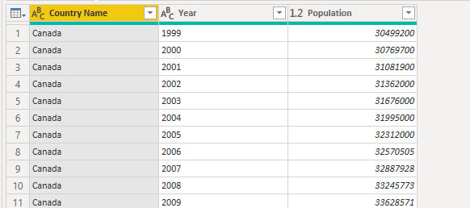

## Bonus: de gekste datastructuren

Tot nu toe hebben we data van vier soorten bronnen ingeladen:

* CSV
* SQL Server
* Azure SQL Database
* Excel-bestanden in een onhandig formaat

Voor de bonus voegen we hier nog één bron aan toe: de IMDB top 250 van films [http://www.imdb.com/chart/top](http://www.imdb.com/chart/top). Hier kunnen we niet direct analyses op doen die aansluiten op ons huidige model, maar het geeft wel mooi aan wat er allemaal mogelijk is in Power BI.

Hieronder staat een screenshot hoe de data er uit moet komen te zien in Power Query. Je kunt de data inladen met "Get Data" -> "From Web".

Tip: Je zult hier de "split column" functionaliteit regelmatig nodig hebben
